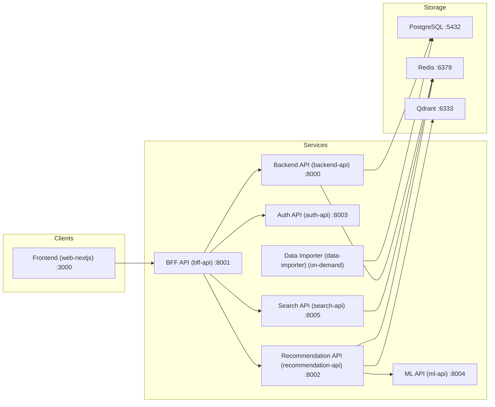

# Next Watch

A comprehensive movie discovery and tracking platform built with modern microservices architecture.

## 🏗️ Architecture

Next Watch is a microservices-based platform with 8 main services:



### Core Services

- **Frontend** ([`apps/web-nextjs`](apps/web-nextjs)): Next.js 15 web application with modern UI/UX
- **BFF API** ([`apps/bff-api`](apps/bff-api)): Backend for Frontend - aggregation and orchestration layer
- **Auth API** ([`apps/auth-api`](apps/auth-api)): Dedicated JWT-based authentication and authorization service
- **Backend API** ([`apps/backend-api`](apps/backend-api)): Core business logic, movie data access, and database operations
- **Recommendation API** ([`apps/recommendation-api`](apps/recommendation-api)): Movie recommendations using vector similarity and collaborative filtering
- **ML API** ([`apps/ml-api`](apps/ml-api)): Machine learning service for generating movie and user embeddings
- **Search API** ([`apps/search-api`](apps/search-api)): Dedicated search service with Redis-powered autocomplete and suggestions
- **Data Importer** ([`apps/data-importer`](apps/data-importer)): Movie data synchronization from TMDB and OMDB

### Infrastructure & Storage

- **PostgreSQL**: Primary database for movie metadata, users, and relational data
- **Redis**: Caching layer and search suggestion storage
- **Qdrant**: Vector database for similarity-based movie recommendations

### Shared Libraries

- **Fast-Core** ([`libs/fast-core`](libs/fast-core)): Standardized FastAPI middleware, configuration, and monitoring framework
  - Consistent middleware stack (CORS, security headers, rate limiting, logging, metrics)
  - OpenTelemetry integration for distributed tracing
  - Health check framework with liveness/readiness/deep probes
  - JWT utilities and authentication helpers
  - Error handling and service error contexts
- **Cache** ([`libs/cache`](libs/cache)): Redis caching utilities with warming and invalidation patterns
  - Cache warming strategies
  - TTL management
  - Key versioning and invalidation
  - Metrics and monitoring
- **Config** ([`libs/config`](libs/config)): Centralized configuration management with environment profiles
  - Environment-based configuration
  - Logging setup with themes
  - Security configuration
  - Service discovery settings
- **CLI** ([`libs/cli`](libs/cli)): Shared command-line interface utilities for service management
  - Service registry pattern
  - Output handling and formatting
  - Common command patterns

## 🛠️ Technology Stack

### Backend Services (Python)

- **Framework**: FastAPI with fast-core standardization
- **Language**: Python 3.12+
- **Package Management**: Hatch
- **ORM**: SQLAlchemy with asyncpg
- **Validation**: Pydantic v2
- **Testing**: pytest
- **Code Quality**: varies by service (commonly mypy/ruff/black/isort); see each service’s `pyproject.toml`

### Frontend (TypeScript)

- **Framework**: Next.js 15 (App Router)
- **Language**: TypeScript
- **Package Management**: pnpm
- **UI Library**: Material-UI (MUI)
- **State Management**: React Context + Zustand
- **Styling**: Emotion CSS-in-JS

### Machine Learning

- **Embeddings**: sentence-transformers (all-MiniLM-L6-v2)
- **Vector Search**: Qdrant vector database
- **Dimensions**: 384-dimensional embeddings
- **Distance Metric**: Cosine similarity

### Infrastructure

- **Database**: PostgreSQL 14+
- **Cache**: Redis 7+
- **Vector DB**: Qdrant
- **Reverse Proxy**: Nginx
- **Containerization**: Docker & Docker Compose
- **Orchestration**: Docker Compose (production), Hatch (development)

### Observability

- **Metrics**: Prometheus
- **Visualization**: Grafana
- **Tracing**: OpenTelemetry + Grafana Alloy
- **Logging**: Structured JSON logs with coloredlogs (development)
- **Alerts**: AlertManager

## 🚀 Quick Start

New to the repo? Start here:

- [`docs/getting-started/ONBOARDING.md`](docs/getting-started/ONBOARDING.md) (recommended local development path)

### Production-like stack (Docker Compose)

Note: [`infra/compose/prod.yml`](infra/compose/prod.yml) expects PostgreSQL and Redis to be reachable on the host (`host.docker.internal`).

```bash
# Clone the repository
git clone https://github.com/your-username/next_watch.git
cd next_watch

# Copy environment template
cp infra/env/prod.example .env.prod

# Edit environment variables
nano .env.prod

# Build all services
docker build -f apps/backend-api/Dockerfile -t next-watch-backend:latest .
docker build -f apps/auth-api/Dockerfile -t next-watch-auth:latest .
docker build -f apps/bff-api/Dockerfile -t next-watch-bff:latest .
docker build -f apps/recommendation-api/Dockerfile -t next-watch-recommendation:latest .
docker build -f apps/ml-api/Dockerfile -t next-watch-ml:latest .
docker build -f apps/search-api/Dockerfile -t next-watch-search:latest .
docker build -f apps/web-nextjs/Dockerfile -t next-watch-frontend:latest .
docker build -f apps/data-importer/Dockerfile -t next-watch-importer:latest .

# Start services
docker compose -f infra/compose/prod.yml --env-file .env.prod up -d

# Check status
docker ps
```

### Using the Deployment Script

```bash
# Make executable
chmod +x scripts/deploy-prod.sh

# Deploy all services
./scripts/deploy-prod.sh

# Deploy with data import
./scripts/deploy-prod.sh --import

# Build only (no deployment)
./scripts/deploy-prod.sh --build-only
```

See [`infra/DEPLOYMENT.md`](infra/DEPLOYMENT.md) for end-to-end deployment docs.

## 🔧 Configuration

### Required Environment Variables

```bash
# Docker Images
DOCKER_BACKEND_IMAGE=next-watch-backend:latest
DOCKER_AUTH_IMAGE=next-watch-auth:latest
DOCKER_BFF_IMAGE=next-watch-bff:latest
DOCKER_RECOMMENDATION_IMAGE=next-watch-recommendation:latest
DOCKER_ML_IMAGE=next-watch-ml:latest
DOCKER_SEARCH_IMAGE=next-watch-search:latest
DOCKER_FRONTEND_IMAGE=next-watch-frontend:latest
DOCKER_IMPORTER_IMAGE=next-watch-importer:latest

# Database
POSTGRES_USER=next_watch_user
POSTGRES_PASSWORD=your-secure-password
POSTGRES_DB=next_watch

# Security
JWT_SECRET=your-super-secure-jwt-secret
INTERNAL_API_KEY=your-internal-api-key

# External APIs
TMDB_ACCESS_TOKEN=your-tmdb-token
OMDB_API_KEY=your-omdb-key

# Service URLs (for inter-service communication)
BACKEND_API_URL=http://backend-api:8000
ML_API_URL=http://ml-api:8000
RECOMMENDATION_API_URL=http://recommendation-api:8000
SEARCH_API_URL=http://search-api:8000
```

See [`infra/env/prod.example`](infra/env/prod.example) for complete configuration options.

## 🔄 CI/CD Workflows

### GitHub Actions

The project includes comprehensive GitHub Actions workflows:

#### **Build Workflow** (`.github/workflows/build.yml`)

- Builds all 8 services when their code changes
- Supports building shared libraries ([`libs/fast-core`](libs/fast-core), [`libs/cache`](libs/cache), [`libs/config`](libs/config), [`libs/cli`](libs/cli))
- Pushes images to GitHub Container Registry
- Supports manual builds with `build_all` option

#### **Deploy Workflow** (`.github/workflows/deploy.yml`)

- Deploys services to production server
- Uses Docker Compose with proper environment configuration
- Supports selective deployment of individual services
- Includes health checks and cleanup

#### **Release Workflow** (`.github/workflows/release.yml`)

- Automatically builds and deploys on `main` branch pushes
- Detects changes in each service
- Orchestrates build → deploy pipeline
- Supports manual releases with custom service selection

### Workflow Triggers

**Automatic (on push to main):**

- Detects changes in each service directory
- Builds only changed services
- Deploys changed services automatically

**Manual (workflow_dispatch):**

- Build all services regardless of changes
- Deploy specific services
- Full stack deployment

### Required Secrets

Configure these in your GitHub repository settings:

```bash
# Deployment
DEPLOY_KEY          # SSH private key for server access
DEPLOY_HOST         # Server hostname/IP
DEPLOY_USER         # SSH username
GH_PAT             # GitHub Personal Access Token

# Database
POSTGRES_USER       # Database username
POSTGRES_PASSWORD   # Database password
POSTGRES_DB         # Database name

# Security
JWT_SECRET          # JWT signing secret
INTERNAL_API_KEY    # Service-to-service API key

# External APIs (optional)
TMDB_ACCESS_TOKEN   # The Movie Database API token
OMDB_API_KEY        # Open Movie Database API key
```

## 📊 Monitoring & Health Checks

### Production Monitoring Stack

Deploy comprehensive monitoring to your AWS infrastructure:

```bash
# One-click monitoring deployment to existing AWS instance
cd infra/aws
./deploy-monitoring-one-click.sh
```

This deploys:

- **Prometheus**: Metrics collection from all NextWatch services
- **Grafana**: Dashboards and visualization
- **Grafana Alloy**: OpenTelemetry collector for distributed tracing
- **AlertManager**: Alert routing and notifications
- **Node Exporter**: System resource monitoring

### 📊 Observability Features

All services include built-in observability:

- **Metrics**: Prometheus metrics at `/metrics` endpoint
  - Request rates, latencies, error rates
  - Resource utilization (CPU, memory)
  - Service-specific metrics (cache hit rates, embedding generation times, etc.)
- **Distributed Tracing**: OpenTelemetry integration
  - Request tracing across microservices
  - Configurable sampling rates
  - Integration with Grafana Alloy
- **Structured Logging**: JSON-formatted logs with correlation IDs
  - Request/response logging
  - Error tracking with stack traces
  - Performance monitoring
- **Health Checks**: Multi-level health endpoints
  - `/health` - Aggregated health status
  - `/health/live` - Liveness probe
  - `/health/ready` - Readiness probe (dependencies)
  - `/health/deep` - Detailed diagnostics

### 🔒 Security Features

- **Localhost Binding**: All services bind to `127.0.0.1` only
- **Nginx Reverse Proxy**: Controlled external access
- **BFF-Only API Access**: Direct service access blocked from internet
- **SSL/TLS**: HTTPS with strong cipher suites
- **Rate Limiting**: Per-endpoint rate limits via fast-core
- **Security Headers**: HSTS, CSP, frame protection, XSS protection
- **Internal API Keys**: Service-to-service authentication

Access your monitoring:

- **Grafana**: <https://your-domain.com/grafana/> (credentials configured via [`infra/env/monitoring.prod.example`](infra/env/monitoring.prod.example))
- **Prometheus**: <https://your-domain.com/prometheus/>
- **AlertManager**: <https://your-domain.com/alertmanager/>

### Service Health Checks

All services include comprehensive health checks:

- **Backend API**: `GET /health` - Database, Redis, and service status
- **Auth API**: `GET /health` - Database, cache, and JWT service status
- **BFF API**: `GET /health` - Aggregates downstream service health
- **Recommendation API**: `GET /health` - Qdrant, Redis, ML API, and Backend API status
- **ML API**: `GET /health` - Model loading status and embedding service health
- **Search API**: `GET /health` - Redis connection and suggestion engine status
- **Frontend**: Process-based health check
- **Data Importer**: On-demand service

Health checks include:

- Service availability (liveness probes)
- Database connectivity (readiness probes)
- Dependency verification (upstream services)
- Resource monitoring (memory, CPU)
- Deep diagnostics (detailed component status)

## 🛠️ Development

### Local Development (Recommended)

The primary local dev workflow is to start **all services** in a single tmux session:

```bash
# From project root
./infra/tmux/start_services_tmux.sh
```

This will start Redis + Qdrant + all APIs + the Next.js frontend and attach you to a `nextwatch` tmux session.
See [`infra/tmux/README.md`](infra/tmux/README.md) for prerequisites, window layout, and troubleshooting.

### Individual Service Development

Each service can be developed independently using Hatch (Python services) or pnpm (Frontend):

```bash
# Backend API
cd apps/backend-api
hatch env create
hatch run dev

# Auth API
cd apps/auth-api
hatch env create
hatch run dev

# BFF API
cd apps/bff-api
hatch env create
hatch run dev

# Recommendation API
cd apps/recommendation-api
hatch env create
hatch run dev

# ML API
cd apps/ml-api
hatch env create
hatch run dev

# Search API
cd apps/search-api
hatch env create
hatch run dev

# Frontend
cd apps/web-nextjs
pnpm install
pnpm dev

# Data Importer
cd apps/data-importer
hatch env create
hatch run cli sync --verbose
```

### Python Project Configuration

Python services are **mostly** configured via `pyproject.toml`, and use Hatch for env management.

Notes:

- Some apps may also include additional config files (for example `hatch.toml` or `requirements.txt`) to support legacy workflows or Docker builds.
- Always follow the service’s README and config in `apps/<service>/`.

### CLI Tools

Each Python service includes comprehensive CLI tools accessible via Hatch:

```bash
# Backend API
cd apps/backend-api
hatch run cli --help
hatch run cli serve start --reload
hatch run cli health check

# Auth API
cd apps/auth-api
hatch run cli --help
hatch run cli serve start --reload
hatch run cli health check

# BFF API
cd apps/bff-api
hatch run cli --help
hatch run cli serve start --reload
hatch run cli cache info

# Recommendation API
cd apps/recommendation-api
hatch run cli --help
hatch run cli embeddings generate --batch-size 100
hatch run cli cache precompute --limit 1000

# ML API
cd apps/ml-api
hatch run cli --help
hatch run cli model info
hatch run cli health check

# Search API
cd apps/search-api
hatch run cli --help
hatch run cli redis populate --force
hatch run cli health check

# Data Importer
cd apps/data-importer
hatch run cli --help
hatch run cli sync --verbose
```

### Available Hatch Scripts

Each service provides these common scripts:

- `serve` - Start the service
- `dev` - Start with auto-reload
- `cli` - Access CLI commands
- `health` - Health checks
- `config` - Show configuration
- `test` - Run tests
- `lint` - Code linting
- `format` - Code formatting

## 📚 Documentation

### Service Documentation

Each service has comprehensive documentation:

- **Backend API**: [`apps/backend-api/README.md`](apps/backend-api/README.md)
  - [Fast-core integration guide](apps/backend-api/docs/FAST_CORE_INTEGRATION.md)
  - [Bulk operations optimization](apps/backend-api/docs/BULK_MOVIES_OPTIMIZATION.md)
  - [Materialized view architecture](apps/backend-api/docs/MOVIE_METADATA_ARCHITECTURE.md)
  - [Metrics integration](apps/backend-api/docs/METRICS_INTEGRATION.md)
- **Recommendation API**: [`apps/recommendation-api/README.md`](apps/recommendation-api/README.md)
  - [Embedding generation CLI](apps/recommendation-api/src/recommendation_api/cli/README.md)
  - [Cache warming strategies](apps/recommendation-api/src/recommendation_api/services/cache_service/warming/README.md)
  - [Docker deployment](apps/recommendation-api/DOCKER.md)
- **ML API**: [`apps/ml-api/README.md`](apps/ml-api/README.md)
  - [Docker deployment](apps/ml-api/DOCKER.md)
- **Search API**: [`apps/search-api/README.md`](apps/search-api/README.md)
  - [Redis suggestion engine](apps/search-api/src/search_api/services/suggestion_engine/README.md)
  - [Search performance plan](apps/search-api/docs/search-suggestions-performance-plan.md)
- **Auth API**: [`apps/auth-api/README.md`](apps/auth-api/README.md)
  - [API refinement guide](apps/auth-api/docs/API_REFINEMENT.md)
  - [Fast-core integration guide](apps/auth-api/docs/FAST_CORE_INTEGRATION.md)
- **BFF API**: [`apps/bff-api/README.md`](apps/bff-api/README.md)
  - [Cache warming strategies](apps/bff-api/src/bff_api/services/cache_service/warming/README.md)
  - [Cache patterns (forever strategy)](apps/bff-api/doc/CACHE_REFINEMENT_FOREVER.md)
- **Data Importer**: [`apps/data-importer/README.md`](apps/data-importer/README.md)
  - [CLI commands](apps/data-importer/src/data_importer/cli/README.md)

### API Documentation

Interactive API documentation available at `/docs` on each service:

- **Backend API**: <http://localhost:8000/docs>
- **Auth API**: <http://localhost:8003/docs>
- **BFF API**: <http://localhost:8001/docs>
- **Recommendation API**: <http://localhost:8002/docs>
- **ML API**: <http://localhost:8004/docs>
- **Search API**: <http://localhost:8005/docs>

### Infrastructure Documentation

- **Docs index**: [`docs/README.md`](docs/README.md)
- **Onboarding (New Devs)**: [`docs/getting-started/ONBOARDING.md`](docs/getting-started/ONBOARDING.md)
- **Service Map**: [`docs/getting-started/SERVICE_MAP.md`](docs/getting-started/SERVICE_MAP.md)
- **Docs Conventions**: [`docs/meta/DOCS_GUIDE.md`](docs/meta/DOCS_GUIDE.md)
- **Deployment Guide**: [`infra/DEPLOYMENT.md`](infra/DEPLOYMENT.md)
- **Production Deployment**: [`infra/production-deployment-guide.md`](infra/production-deployment-guide.md)
- **Monitoring Setup**: [`infra/compose/monitoring.yml`](infra/compose/monitoring.yml)
- **AWS Infrastructure**: [`infra/aws/`](infra/aws/)
- **Security cleanup (making repo public)**: [`docs/security/SECURITY_CLEANUP.md`](docs/security/SECURITY_CLEANUP.md) and [`cleanup-git-history.sh`](cleanup-git-history.sh)

## 🤝 Contributing

1. Fork the repository
2. Create a feature branch
3. Make changes to relevant services
4. Test locally with Docker Compose
5. Submit a pull request

The CI/CD pipeline will automatically:

- Build changed services
- Run tests
- Deploy to staging (if configured)

## 📝 License

This project is licensed under the MIT License - see the LICENSE file for details.

## 📐 Engineering Notes

- Type checking standards: [`docs/development/TYPE_CHECKING.md`](docs/development/TYPE_CHECKING.md)
- Project status / progress notes: [`docs/development/PROJECT_STATUS.md`](docs/development/PROJECT_STATUS.md)
