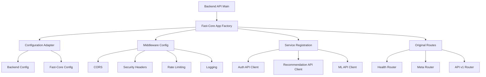

# Fast Core Integration for Backend API

This document outlines the integration of the fast-core library with the Backend API, following the consistent pattern established by the BFF and Recommendation APIs.

## 🎯 Integration Overview

The Backend API has been successfully integrated with fast-core to provide:

- **Standardized middleware configuration** using the MiddlewareConfig builder pattern
- **Service client factory** for inter-service communication
- **Enhanced dependency injection** system
- **Consistent error handling** and response formatting
- **Built-in rate limiting** and security headers
- **Singleton management** for improved performance

## 📁 Integration Structure

The integration follows the established pattern used by other services:

```
backend-api/
├── src/backend_api/
│   ├── config/
│   │   ├── app.py                    # Original configuration (unchanged)
│   │   └── fast_core_config.py       # Fast-core adapter (NEW)
│   ├── core/
│   │   ├── app.py                    # Original app factory (preserved)
│   │   └── app_fast_core.py          # Fast-core app factory (NEW)
│   └── main.py                       # Updated to use fast-core
```

## 🔧 Key Components

### 1. Configuration Adapter (`config/fast_core_config.py`)

Converts Backend API configuration to fast-core compatible format:

```python
def create_fast_core_config(backend_config: BackendAPIConfig) -> FastAPIConfig:
    """Convert Backend API configuration to fast-core configuration."""
    # Maps service URLs, timeouts, feature flags, etc.
```

**Features:**

- Service URL mapping for auth, recommendation, and ML APIs
- Feature flags for suggestion engine, health checks, etc.
- CORS configuration for frontend and service communication
- FastAPI documentation settings based on debug mode

### 2. Fast-Core App Factory (`core/app_fast_core.py`)

Creates FastAPI application using fast-core patterns:

```python
def create_backend_app(config: Optional[BackendAPIConfig] = None) -> FastAPI:
    """Create Backend API application using fast-core."""
    # Uses MiddlewareConfig, service registration, etc.
```

**Features:**

- **Lifespan Management**: Database, health service, and suggestion engine initialization
- **Service Registration**: Auto-registers external services with fast-core service factory
- **Middleware Configuration**: CORS, security headers, rate limiting, logging
- **Router Integration**: Includes all existing routes (meta, health, api_v1)

### 3. Middleware Configuration

Backend-specific middleware setup with production-ready defaults:

#### CORS Configuration

```python
middleware.cors(
    origins=config.cors_origins,
    credentials=True,  # Backend needs credentials for auth
    methods=["GET", "POST", "PUT", "DELETE", "PATCH", "OPTIONS"],
    headers=["Content-Type", "Authorization", "X-Requested-With", "X-Request-ID"],
    expose_headers=["X-Request-ID", "X-Process-Time", "X-Cache-Status"],
    max_age=3600,  # Cache preflight requests for 1 hour
)
```

#### Security Headers

- **Production**: HSTS, CSP, frame protection, XSS protection
- **Development**: More permissive settings for easier debugging

#### Rate Limiting

```python
rate_limit_config = {
    # Core movie data endpoints
    "/api/v1/movies": "300/minute",
    "/api/v1/movies/{movie_id}": "500/minute",
    "/api/v1/movies/search": "100/minute",
    "/api/v1/movies/bulk": "50/minute",
    "/api/v1/movies/{movie_id}/cast": "200/minute",
    "/api/v1/movies/{movie_id}/trailers": "200/minute",
    # User interaction endpoints (auth handled by BFF)
    "/api/v1/user/movies": "200/minute",
    "/api/v1/user/movies/{movie_id}": "100/minute",
}
```

#### Request Processing

- Request ID tracking
- Process time headers
- GZIP compression
- Body size limits (10MB for file uploads)

## 🚀 Independent Service Architecture

### Core Data Operations

The Backend API operates independently without external service calls:

```python
# Direct database access for core movie data
@router.get("/movies/{movie_id}")
async def get_movie_details(
    movie_id: int,
    request_id: str = Depends(get_request_id()),
    db: Session = Depends(get_db)
):
    movie = movie_query.get_movie_details(db, movie_id)
    genres = movie_query.get_movie_genres(db, movie_id)
    return format_movie_for_response(movie, genres, request_id)
```

### Service Boundaries

- **Backend API**: Core movie data, user interactions, search functionality
- **BFF API**: Service orchestration, authentication, external API integration
- **Auth API**: User authentication and authorization
- **Recommendation API**: Movie recommendations and ML-driven features

### Fast-Core Benefits for Independent Service

Even without external service calls, fast-core provides:

```python
# Enhanced request tracking
@router.get("/movies")
async def list_movies(
    request: Request,
    pagination: PaginationParams = get_pagination(max_page_size=100),
    request_id: str = Depends(get_request_id),
):
    logger.info(f"[{request_id}] Fetching movies")
    # Core functionality with enhanced monitoring
```

## 📊 Feature Flags

The integration includes Backend API specific feature flags:

```python
feature_flags = {
    "health_checks": True,
    "user_interactions": True,
    "advanced_search": True,
    "movie_details": True,
    "cast_information": True,
    "movie_trailers": True,
    "bulk_operations": True,
}
```

## 🔄 Backward Compatibility

The integration maintains full backward compatibility:

- **Original app factory** (`core/app.py`) is preserved
- **Configuration system** remains unchanged
- **All existing routes** continue to work
- **Database and health services** maintain same initialization

## 🛠 Development Workflow

### Installation

```bash
# Install fast-core dependency
hatch run install-libs

# Start development server
hatch run dev
```

### Testing Integration

The application automatically uses fast-core integration. Monitor logs for:

```
INFO: Initializing Next Watch Backend Service with Fast Core integration
INFO: Creating Backend API application with fast-core and enhanced middleware
INFO: Registering external services
INFO: Backend API application created with fast-core integration
```

## 📈 Benefits

### 1. **Standardized Patterns**

- Consistent middleware configuration across all services
- Unified service client management
- Standardized error handling and logging

### 2. **Enhanced Security**

- Built-in rate limiting with configurable endpoints
- Production-ready security headers
- CORS configuration with credential support

### 3. **Better Performance**

- Singleton service clients reduce connection overhead
- Request ID tracking for better debugging
- GZIP compression and optimized headers

### 4. **Improved Monitoring**

- Process time tracking
- Request/response logging with configurable levels
- Health check integration

### 5. **Developer Experience**

- Simplified service client usage
- Consistent dependency injection patterns
- Better error messages and debugging

## 🔧 Configuration

### Environment Variables

The integration respects all existing environment variables and adds:

```bash
# Service URLs (optional - defaults provided)
AUTH_API_URL=http://localhost:8001
RECOMMENDATION_API_URL=http://localhost:8002
ML_API_URL=http://localhost:8003

# Redis for suggestion engine (existing)
SUGGESTION_REDIS_URL=redis://localhost:6379/1
CACHE_REDIS_URL=redis://localhost:6379/0
```

### Service Timeouts

Default timeouts are configured per service:

- **Auth API**: 30 seconds
- **Recommendation API**: 60 seconds
- **ML API**: 120 seconds (longer for ML processing)

## 🧪 Testing

The integration includes comprehensive testing support:

```python
# Test with fast-core integration
from backend_api.core.app_fast_core import create_backend_app

def test_app_creation():
    app = create_backend_app()
    assert app.title == "Next Watch Backend API"
    assert "fast-core" in str(app.middleware_stack)
```

## 🔄 Migration Path

The integration provides a smooth migration path:

1. **Phase 1**: Fast-core runs alongside existing system
2. **Phase 2**: Gradual adoption of fast-core features
3. **Phase 3**: Full migration to fast-core patterns
4. **Phase 4**: Removal of legacy code (future)

## 📚 Related Documentation

- [Fast Core Library Documentation](../../libs/fast-core/README.md)
- [BFF API Fast Core Integration](../bff-api/FAST_CORE_INTEGRATION.md)
- [Recommendation API Fast Core Integration](../recommendation-api/OVERVIEW.md)
- [Service Client Factory Guide](../../libs/fast-core/src/fast_core/dependencies/README.md)

## 🏗 Architecture Diagram



This integration establishes the Backend API as a fully fast-core compatible service while maintaining all existing functionality and providing a foundation for future enhancements.
