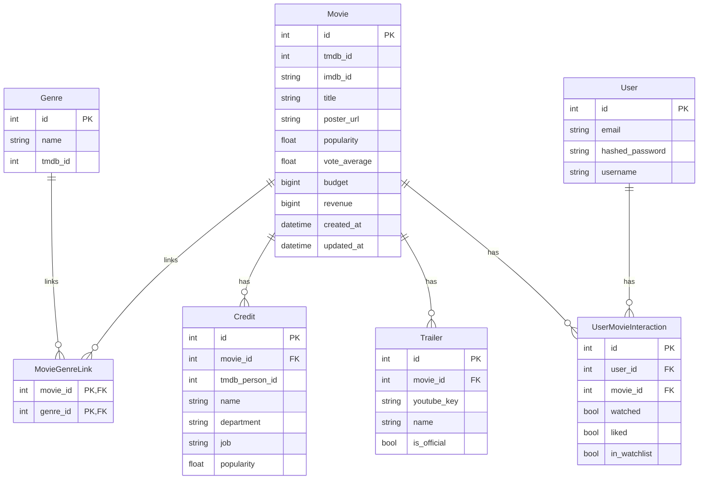

***REMOVED*** Backend API Models

***REMOVED******REMOVED*** Overview

This directory contains SQLModel definitions for core domain entities used by the Backend API.

- **Movie** (`movie`)
  - External IDs: `tmdb_id` (unique, indexed), `imdb_id` (optional, indexed)
  - Fields: titles, overview, language, release_date, runtime, poster_url, backdrop_url, popularity, vote_average/vote_count, budget, revenue, ratings (IMDb/RottenTomatoes/Metacritic), awards
  - Relationships: `genres` (many-to-many via `movie_genre_link`), `credits`, `trailers`, `user_interactions`
- **Genre** (`genre`)
  - Fields: `name`, `tmdb_id` (optional, unique, indexed)
  - Relationships: `movies` (many-to-many via `movie_genre_link`)
- **MovieGenreLink** (`movie_genre_link`)
  - Association table: `movie_id` + `genre_id` (composite PK)
- **Credit** (`credit`)
  - Fields: `movie_id`, `tmdb_person_id` (indexed), `name`, `character`, `department`, `job`, `cast_id`, `order`, `gender`, `profile_path`, `popularity`, `credit_id`, `adult`
  - Relationship: `movie`
- **Trailer** (`trailer`)
  - Fields: `movie_id`, `youtube_key` (indexed), `name`, `is_official`, `url_link`, timestamps
  - Relationship: `movie`
- **User** (`user`)
  - Fields: `email` (unique, indexed), `hashed_password`, `username` (optional, indexed), timestamps
  - Relationships: `movie_interactions`
  - Helpers: `hash_password(password)`, `verify_password(password)`
- **UserMovieInteraction** (`user_movie_interactions`)
  - Fields: `user_id` (FK), `movie_id` (FK), flags: `watched`, `liked`, `in_watchlist`, timestamps
  - Constraint: unique (`user_id`, `movie_id`) → `uq_user_movie_interaction`
  - Relationships: `user`, `movie`

***REMOVED******REMOVED*** Entity Relationships (ER)



***REMOVED******REMOVED*** Table Names

- Explicit: `movie_genre_link`, `user_movie_interactions`
- Defaults (derived from class name): `movie`, `genre`, `credit`, `trailer`, `user`

***REMOVED******REMOVED*** Notable Constraints & Types

- `Movie.tmdb_id` unique; `Genre.tmdb_id` unique when present
- `User.email` unique
- `UserMovieInteraction` unique pair (`user_id`, `movie_id`)
- `Movie.budget`/`Movie.revenue` use BIGINT to handle large values

***REMOVED******REMOVED*** Creating/Updating Tables

Use the service CLI and migrations (preferred):

```bash
***REMOVED*** Apply migrations (recommended)
backend-api db migrate

***REMOVED*** Initialize DB and optionally create tables (dev quick start)
backend-api db init --create-tables
```

For schema checks and profiling utilities:

```bash
python -m backend_api.scripts.setup_db check-schema
python -m backend_api.scripts.setup_db profile-db --duration 30  ***REMOVED*** dev only
```

***REMOVED******REMOVED*** Usage Example (SQLModel)

```python
from sqlmodel import Session, select
from backend_api.models import Movie
from backend_api.db.database import get_engine

engine = get_engine()
with Session(engine) as session:
    top = session.exec(select(Movie).order_by(Movie.popularity.desc()).limit(10)).all()
    print([m.title for m in top])
```

***REMOVED******REMOVED*** Notes

- API routes return consistent pagination with fields: `total, page, per_page, total_pages, has_next, has_prev`.
- Some endpoints use precomputed metadata (materialized views) for performance; see `db/migrations` for details.
