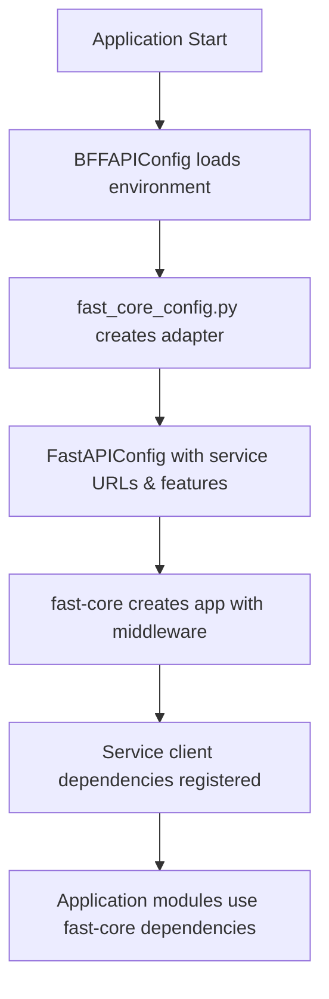

***REMOVED*** BFF API Configuration System

This directory contains the configuration modules for the BFF (Backend for Frontend) API service, now integrated with the **fast-core** library for standardized FastAPI application patterns.

***REMOVED******REMOVED*** 📁 Module Overview

***REMOVED******REMOVED******REMOVED*** [`__init__.py`](./pycache/__init__.py)

**Central configuration exports and initialization**

- Provides clean public API for importing configuration components
- Exports main classes and functions used throughout the application
- Handles initialization order to prevent circular dependencies

***REMOVED******REMOVED******REMOVED*** [`app.py`](./app.py)

**Legacy BFF configuration management**

- Main `BFFAPIConfig` class with comprehensive service configuration
- Environment-specific defaults and validation
- Service URL configuration (backend, auth, recommendation, ML APIs)
- Security settings, CORS, caching, and performance metrics
- **Still actively used** by many modules and the fast-core adapter

***REMOVED******REMOVED******REMOVED*** [`fast_core_config.py`](./fast_core_config.py)

**Fast-core integration adapter**

- Converts `BFFAPIConfig` to fast-core's `FastAPIConfig`
- Maps BFF-specific settings to fast-core configuration structure
- Enables service client dependencies and feature flags
- **Primary integration point** between BFF and fast-core

***REMOVED******REMOVED*** 🔄 Configuration Flow (Fast-Core Integration)



***REMOVED******REMOVED*** 🚀 Quick Start

***REMOVED******REMOVED******REMOVED*** Basic Usage

```python
***REMOVED*** Import BFF configuration (legacy, still needed)
from bff_api.config.app import BFFAPIConfig, settings

***REMOVED*** Import fast-core dependencies (new pattern)
from fast_core.dependencies import get_backend_client, get_auth_client
from fast_core import get_logger

***REMOVED*** Get global configuration instance
config = BFFAPIConfig()

***REMOVED*** Get a structured logger (fast-core)
logger = get_logger(__name__)

***REMOVED*** Use in route handlers with dependency injection
from fastapi import Depends

async def get_movies(
    backend_client = Depends(get_backend_client),
):
    movies = await backend_client.get_movies()
    return movies
```

***REMOVED******REMOVED******REMOVED*** Environment Setup

Create a `.env` file in your project root:

```bash
***REMOVED*** Server Configuration
HOST=0.0.0.0
PORT=8001
DEBUG=true
CORS_ORIGINS=http://localhost:3000,http://localhost:3001

***REMOVED*** Backend Services
BACKEND_API_URL=http://localhost:8000
RECOMMENDATION_API_URL=http://localhost:8003
AUTH_API_URL=http://localhost:8002
ML_API_URL=http://localhost:8004

***REMOVED*** Service Timeouts
BACKEND_API_TIMEOUT=30
AUTH_API_TIMEOUT=10
RECOMMENDATION_API_TIMEOUT=30
ML_API_TIMEOUT=60

***REMOVED*** Feature Flags
ENABLE_RECOMMENDATIONS=true
ENABLE_ML_FEATURES=false
ENABLE_AUTH_SERVICE=true

***REMOVED*** Security
JWT_SECRET=your-jwt-secret-here
INTERNAL_API_KEY=bff-to-backend-secret

***REMOVED*** Logging
LOG_LEVEL=INFO
LOGS_DIR=./logs

***REMOVED*** Cache & Database
REDIS_URL=redis://localhost:6379/0
CACHE_TTL=300
```

***REMOVED******REMOVED*** 📚 Fast-Core Integration Details

***REMOVED******REMOVED******REMOVED*** Configuration Adapter

The `fast_core_config.py` module converts BFF configuration to fast-core format:

```python
from bff_api.config.fast_core_config import create_fast_core_config
from bff_api.config.app import BFFAPIConfig

***REMOVED*** Convert BFF config to fast-core config
bff_config = BFFAPIConfig()
fast_core_config = create_fast_core_config(bff_config)

***REMOVED*** Fast-core config includes:
***REMOVED*** - service_urls: Dict[str, str] for all service endpoints
***REMOVED*** - service_timeouts: Dict[str, int] for request timeouts
***REMOVED*** - feature_flags: Dict[str, bool] for feature toggles
```

***REMOVED******REMOVED******REMOVED*** Service Client Dependencies

Fast-core provides pre-configured service clients:

```python
from fast_core.dependencies import (
    get_backend_client,
    get_auth_client,
    get_recommendation_client,
    get_ml_client
)
from fastapi import Depends

async def my_route(
    backend = Depends(get_backend_client),
    auth = Depends(get_auth_client),
):
    ***REMOVED*** Use httpx.AsyncClient instances configured with service URLs
    movies = await backend.get("/movies")
    user = await auth.get("/user/profile")
```

***REMOVED******REMOVED******REMOVED*** Application Factory Integration

The BFF now uses fast-core's application factory:

```python
***REMOVED*** apps/bff-api/src/bff_api/core/app_fast_core.py
from fast_core import create_app, AppOptions
from bff_api.config.fast_core_config import create_fast_core_config

def create_bff_app(config: Optional[BFFAPIConfig] = None) -> FastAPI:
    if config is None:
        config = BFFAPIConfig()

    ***REMOVED*** Convert to fast-core config
    fast_core_config = create_fast_core_config(config)

    ***REMOVED*** Create app with fast-core
    app = create_app(
        settings=fast_core_config,
        title="BFF API",
        options=AppOptions(
            middleware=True,      ***REMOVED*** Fast-core middleware
            exception_handlers=True,
            health_checks=True,
            cors=True,
            docs=True,
        ),
        routers=routers,
        lifespan=bff_lifespan,
    )
    return app
```

***REMOVED******REMOVED*** 🏗️ Architecture Changes

***REMOVED******REMOVED******REMOVED*** What Fast-Core Provides

✅ **Middleware**: Logging, CORS, security, error handling  
✅ **Dependencies**: Service clients, auth, configuration  
✅ **Health Checks**: Comprehensive health monitoring  
✅ **Exception Handlers**: Standardized error responses  
✅ **App Factory**: Consistent application creation pattern

***REMOVED******REMOVED******REMOVED*** What BFF Still Manages

✅ **BFF Config**: Service-specific configuration (`BFFAPIConfig`)  
✅ **Route Logic**: Business logic and data aggregation  
✅ **Cache Integration**: BFF-specific caching patterns  
✅ **Service Facades**: `BackendClient` facade for cache compatibility

***REMOVED******REMOVED******REMOVED*** Migration Benefits

1. **Reduced Code**: Eliminated custom middleware implementations
2. **Standardization**: Consistent patterns across all services
3. **Enhanced Features**: Better logging, health checks, error handling
4. **Maintainability**: Single source of truth for common functionality
5. **Type Safety**: Better dependency injection and configuration

***REMOVED******REMOVED*** 🔧 Configuration Options

***REMOVED******REMOVED******REMOVED*** Service URLs & Timeouts

```bash
***REMOVED*** Service endpoints
BACKEND_API_URL=http://localhost:8000
AUTH_API_URL=http://localhost:8002
RECOMMENDATION_API_URL=http://localhost:8003
ML_API_URL=http://localhost:8004

***REMOVED*** Per-service timeouts
BACKEND_API_TIMEOUT=30
AUTH_API_TIMEOUT=10
RECOMMENDATION_API_TIMEOUT=30
ML_API_TIMEOUT=60
```

***REMOVED******REMOVED******REMOVED*** Feature Flags

```bash
***REMOVED*** Control feature availability
ENABLE_RECOMMENDATIONS=true
ENABLE_ML_FEATURES=false
ENABLE_AUTH_SERVICE=true
```

***REMOVED******REMOVED******REMOVED*** Fast-Core Settings

All standard fast-core configuration options are supported through the adapter.

***REMOVED******REMOVED*** 📝 Migration Examples

***REMOVED******REMOVED******REMOVED*** Old Pattern (Deprecated)

```python
***REMOVED*** OLD: Manual middleware and client setup
from bff_api.middlewares import LoggingMiddleware, AuthMiddleware
from bff_api.services.clients import BackendClient

app.add_middleware(LoggingMiddleware)
app.add_middleware(AuthMiddleware)
backend_client = BackendClient(config)
```

***REMOVED******REMOVED******REMOVED*** New Pattern (Current)

```python
***REMOVED*** NEW: Fast-core handles middleware and dependencies
from fast_core.dependencies import get_backend_client
from fast_core import create_app

***REMOVED*** Middleware automatically configured by fast-core
app = create_app(settings=fast_core_config, options=AppOptions(middleware=True))

***REMOVED*** Dependencies injected per-request
async def route(backend = Depends(get_backend_client)):
    return await backend.get("/data")
```

***REMOVED******REMOVED*** 🐛 Troubleshooting

***REMOVED******REMOVED******REMOVED*** Common Issues

1. **Service client errors**: Check service URLs in `.env` file
2. **Missing dependencies**: Import from `fast_core.dependencies`
3. **Configuration mismatch**: Verify fast-core adapter mapping
4. **Legacy imports**: Update imports to use fast-core patterns

***REMOVED******REMOVED******REMOVED*** Debug Configuration

```python
from bff_api.config.app import BFFAPIConfig
from bff_api.config.fast_core_config import create_fast_core_config

***REMOVED*** Check BFF config
bff_config = BFFAPIConfig()
print("BFF Config:", bff_config.dict())

***REMOVED*** Check fast-core config
fast_core_config = create_fast_core_config(bff_config)
print("Fast-core Config:", fast_core_config.dict())
```

---

This configuration system now provides a robust foundation built on fast-core standards, maintaining BFF-specific functionality while leveraging shared infrastructure patterns.
