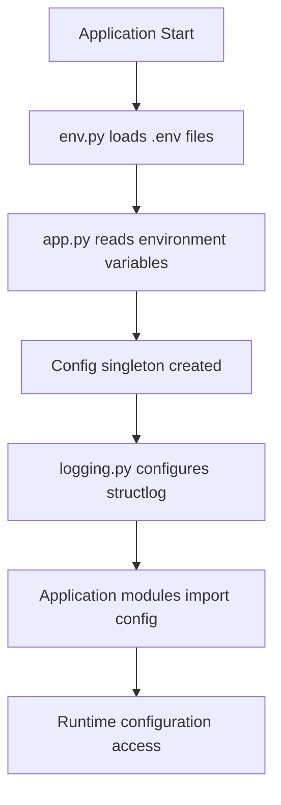

***REMOVED*** BFF API Configuration System

This directory contains the configuration modules for the BFF (Backend for Frontend) API service. The configuration system is designed to be modular, environment-aware, and production-ready.

***REMOVED******REMOVED*** 📁 Module Overview

***REMOVED******REMOVED******REMOVED*** [`__init__.py`](./pycache/__init__.py)

**Central configuration exports and initialization**

- Provides clean public API for importing configuration components
- Exports main classes and functions used throughout the application
- Handles initialization order to prevent circular dependencies

***REMOVED******REMOVED******REMOVED*** [`env.py`](./env.py)

**Environment variable loading and validation**

- Hierarchical `.env` file loading (`.env` → `.env.local`)
- Type-safe environment variable parsing (string, boolean, integer)
- Project root auto-detection for flexible deployment scenarios
- Validation for required environment variables

***REMOVED******REMOVED******REMOVED*** [`app.py`](./app.py)

**Application configuration management**

- Main `Config` class with singleton pattern for global configuration
- Environment-specific defaults and validation
- Service URL configuration (backend, auth, recommendation APIs)
- Security settings, CORS, caching, and performance metrics
- Production-safe defaults with debug mode controls

***REMOVED******REMOVED******REMOVED*** [`logging.py`](./logging.py)

**Structured logging configuration**

- Centralized structlog setup with multiple output formats
- Console logging with customizable color themes
- JSON file logging for production environments
- Configurable log levels and noise suppression
- Standardized logger factory function

***REMOVED******REMOVED*** 🔄 Configuration Flow



***REMOVED******REMOVED*** 🚀 Quick Start

***REMOVED******REMOVED******REMOVED*** Basic Usage

```python
***REMOVED*** Import the main configuration
from bff_api.config import Config, get_logger

***REMOVED*** Get global configuration instance
config = Config.get_instance()

***REMOVED*** Get a structured logger
logger = get_logger("my_module")

***REMOVED*** Use configuration values
backend_url = config.backend_api_url
debug_mode = config.debug
log_level = config.log_level
```

***REMOVED******REMOVED******REMOVED*** Environment Setup

Create a `.env` file in your project root:

```bash
***REMOVED*** Server Configuration
HOST=0.0.0.0
PORT=8001
DEBUG=true
CORS_ORIGINS=http://localhost:3000,http://localhost:3001

***REMOVED*** Backend Services
BACKEND_API_URL=http://localhost:8000
RECO_API_URL=http://localhost:8002
AUTH_API_URL=http://localhost:8003

***REMOVED*** Security
JWT_SECRET=your-jwt-secret-here
INTERNAL_API_KEY=bff-to-backend-secret

***REMOVED*** Logging
LOG_LEVEL=INFO
LOGS_DIR=./logs

***REMOVED*** Cache & Database
REDIS_URL=redis://localhost:6379/0
CACHE_TTL=300
```

***REMOVED******REMOVED******REMOVED*** Local Development Overrides

Create a `.env.local` file (git-ignored) for local-specific settings:

```bash
***REMOVED*** Override for local development
DEBUG=true
LOG_LEVEL=DEBUG
BACKEND_API_URL=http://host.docker.internal:8000
```

***REMOVED******REMOVED*** 📚 Detailed Usage

***REMOVED******REMOVED******REMOVED*** Environment Variables (`env.py`)

The environment loading system supports hierarchical configuration:

```python
from bff_api.config.env import get_env_var, get_env_bool, get_env_int

***REMOVED*** String variables with defaults and validation
api_url = get_env_var("BACKEND_API_URL", default="http://localhost:8000")
secret = get_env_var("JWT_SECRET", required=True)  ***REMOVED*** Raises if missing

***REMOVED*** Boolean variables (accepts: true, 1, yes, on, enabled)
debug = get_env_bool("DEBUG", default=False)
metrics = get_env_bool("ENABLE_PERFORMANCE_METRICS", default=False)

***REMOVED*** Integer variables with error handling
port = get_env_int("PORT", default=8001)
timeout = get_env_int("BACKEND_API_TIMEOUT", default=30)
```

***REMOVED******REMOVED******REMOVED*** Application Configuration (`app.py`)

The `Config` class provides structured access to all settings:

```python
from bff_api.config.app import Config

***REMOVED*** Get singleton instance (recommended)
config = Config.get_instance()

***REMOVED*** Access configuration sections
print(f"Server running on {config.host}:{config.port}")
print(f"Debug mode: {config.debug}")
print(f"Backend API: {config.backend_api_url}")
print(f"CORS origins: {config.cors_origins}")

***REMOVED*** Environment detection
if config.is_production:
    print("Running in production mode")
else:
    print("Running in development mode")

***REMOVED*** Direct instantiation (not recommended in application code)
custom_config = Config(
    host="0.0.0.0",
    port=8002,
    debug=True
)
```

***REMOVED******REMOVED******REMOVED*** Structured Logging (`logging.py`)

The logging system provides consistent structured logging across the application:

```python
from bff_api.config.logging import get_logger, configure_logging
from pathlib import Path

***REMOVED*** Configure logging (typically done in main.py)
config = configure_logging(
    log_level="INFO",
    log_dir=Path("./logs"),
    verbose=True,
    color_theme="modern"  ***REMOVED*** modern, classic, minimal, solarized
)

***REMOVED*** Get logger for your module
logger = get_logger("bff_api.routes.movies")

***REMOVED*** Structured logging with context
logger.info(
    "Processing movie request",
    movie_id=123,
    user_id=456,
    service="bff",
    endpoint="movie_detail"
)

logger.error(
    "Database connection failed",
    error=str(exception),
    retry_count=3,
    service="bff",
    component="database"
)
```

***REMOVED******REMOVED******REMOVED*** Color Themes

Available logging color themes:

- **`modern`** (default): Bold, high-contrast colors for development
- **`classic`**: Traditional terminal colors
- **`minimal`**: Subtle colors for focused readability
- **`solarized`**: Solarized color scheme for compatible terminals

***REMOVED******REMOVED*** 🏗️ Architecture Patterns

***REMOVED******REMOVED******REMOVED*** Singleton Configuration

The `Config` class uses the singleton pattern to ensure consistent configuration across the application:

```python
***REMOVED*** All these calls return the same instance
config1 = Config.get_instance()
config2 = Config.get_instance()
assert config1 is config2  ***REMOVED*** True
```

***REMOVED******REMOVED******REMOVED*** Environment Hierarchy

Configuration follows a clear precedence order:

1. **Environment variables** (highest priority)
2. **`.env.local`** (local overrides, git-ignored)
3. **`.env`** (default values, committed to git)
4. **Code defaults** (lowest priority)

***REMOVED******REMOVED******REMOVED*** Circular Dependency Prevention

The modules are designed to avoid circular imports:

- `env.py` has no internal dependencies
- `app.py` imports from `env.py` only
- `logging.py` has minimal dependencies
- `__init__.py` orchestrates exports

***REMOVED******REMOVED*** 🔧 Configuration Options

***REMOVED******REMOVED******REMOVED*** Server Settings

- `HOST`: Server bind address (default: `0.0.0.0`)
- `PORT`: Server port (default: `8001`)
- `DEBUG`: Debug mode flag (default: `False`)
- `CORS_ORIGINS`: Allowed CORS origins (default: `*`)

***REMOVED******REMOVED******REMOVED*** Backend Services

- `BACKEND_API_URL`: Main backend service URL
- `RECO_API_URL`: Recommendation service URL
- `AUTH_API_URL`: Authentication service URL
- `BACKEND_API_TIMEOUT`: Request timeout in seconds

***REMOVED******REMOVED******REMOVED*** Security

- `JWT_SECRET`: Secret for JWT token validation
- `INTERNAL_API_KEY`: Service-to-service authentication
- `ALLOWED_HOSTS`: Allowed request hosts

***REMOVED******REMOVED******REMOVED*** Logging & Monitoring

- `LOG_LEVEL`: Logging level (`DEBUG`, `INFO`, `WARNING`, `ERROR`)
- `LOGS_DIR`: Directory for log files
- `ENABLE_PERFORMANCE_METRICS`: Enable performance tracking

***REMOVED******REMOVED******REMOVED*** Cache & Storage

- `REDIS_URL`: Redis connection string
- `CACHE_TTL`: Cache time-to-live in seconds

***REMOVED******REMOVED*** 🚦 Production Considerations

***REMOVED******REMOVED******REMOVED*** Security

- Never commit `.env.local` or production secrets
- Use strong, unique secrets for `JWT_SECRET` and `INTERNAL_API_KEY`
- Set `DEBUG=false` in production
- Configure proper `ALLOWED_HOSTS` and `CORS_ORIGINS`

***REMOVED******REMOVED******REMOVED*** Performance

- Enable `ENABLE_PERFORMANCE_METRICS` for monitoring
- Set appropriate `CACHE_TTL` values
- Configure `BACKEND_API_TIMEOUT` for your network conditions

***REMOVED******REMOVED******REMOVED*** Logging

- Use `LOG_LEVEL=INFO` or `WARNING` in production
- Configure `LOGS_DIR` for persistent storage
- Consider log rotation and retention policies

***REMOVED******REMOVED*** 📝 Examples

***REMOVED******REMOVED******REMOVED*** FastAPI Integration

```python
***REMOVED*** main.py
from bff_api.config import Config, configure_logging, get_logger
from pathlib import Path

def create_app():
    ***REMOVED*** Load configuration
    config = Config.get_instance()

    ***REMOVED*** Configure logging
    configure_logging(
        log_level=config.log_level,
        log_dir=config.logs_dir,
        verbose=config.debug
    )

    logger = get_logger("bff_api.main")
    logger.info("Starting BFF API", config=config.to_dict())

    ***REMOVED*** Create FastAPI app with configuration
    app = FastAPI(
        title="BFF API",
        debug=config.debug,
    )

    return app
```

***REMOVED******REMOVED******REMOVED*** Environment-Specific Configuration

```python
***REMOVED*** Development
DEBUG=true
LOG_LEVEL=DEBUG
BACKEND_API_URL=http://localhost:8000

***REMOVED*** Production
DEBUG=false
LOG_LEVEL=WARNING
BACKEND_API_URL=https://api.production.com
```

***REMOVED******REMOVED******REMOVED*** Custom Configuration Extensions

```python
***REMOVED*** Extending the config for new features
from bff_api.config.app import Config

class ExtendedConfig(Config):
    def __init__(self, *args, **kwargs):
        super().__init__(*args, **kwargs)
        self.custom_feature_enabled = get_env_bool("CUSTOM_FEATURE", False)
        self.custom_api_url = get_env_var("CUSTOM_API_URL")
```

***REMOVED******REMOVED*** 🐛 Troubleshooting

***REMOVED******REMOVED******REMOVED*** Common Issues

1. **Missing .env file**: The system gracefully falls back to environment variables
2. **Invalid environment values**: Check console output for validation errors
3. **Circular imports**: Import from `bff_api.config` rather than individual modules
4. **Logging not working**: Ensure `configure_logging()` is called before using loggers

***REMOVED******REMOVED******REMOVED*** Debug Configuration

```python
from bff_api.config import Config

config = Config.get_instance()
print("Current configuration:")
for key, value in config.__dict__.items():
    if 'secret' not in key.lower():  ***REMOVED*** Don't print secrets
        print(f"  {key}: {value}")
```

---

This configuration system provides a robust foundation for environment management, structured logging, and application settings that scales from development to production deployments.
