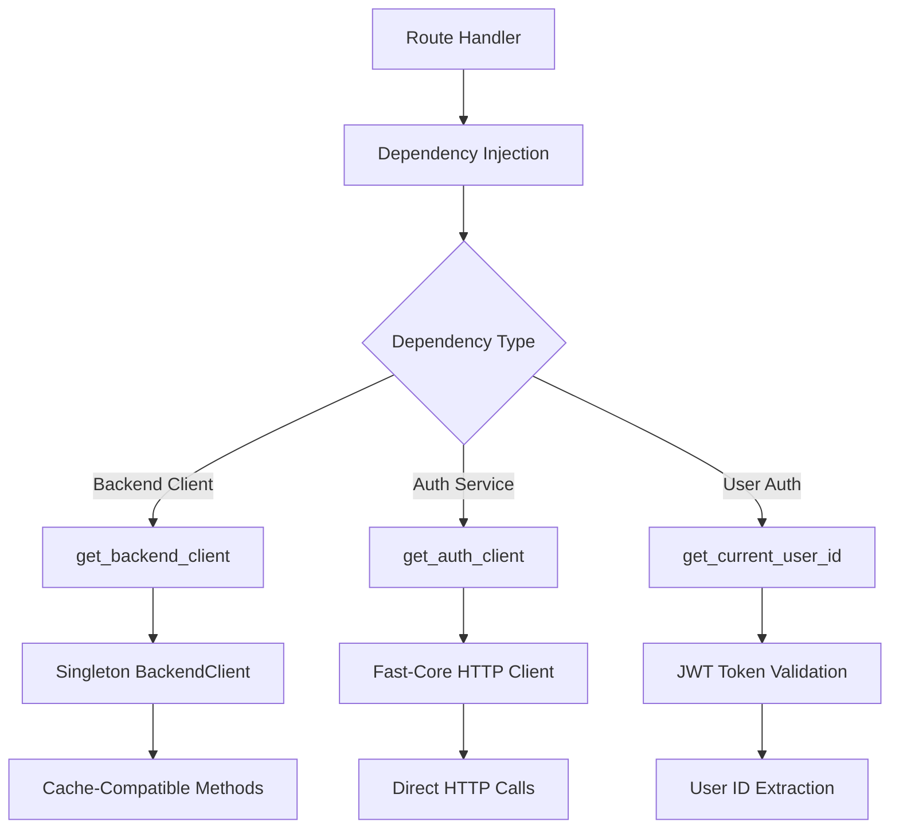

***REMOVED*** BFF API Dependencies

This directory contains dependency injection providers for the BFF (Backend for Frontend) API service, implementing a **hybrid architecture** that combines fast-core standardized dependencies with BFF-specific optimizations.

***REMOVED******REMOVED*** 📁 Module Overview

The dependencies system follows a hybrid approach:

```
bff_api/dependencies/
├── __init__.py    ***REMOVED*** Central exports (fast-core + BFF-specific)
├── backend.py     ***REMOVED*** BFF-specific BackendClient singleton
├── auth.py        ***REMOVED*** Custom JWT authentication dependencies
└── README.md      ***REMOVED*** This documentation
```

***REMOVED******REMOVED*** 🏗️ Hybrid Architecture

***REMOVED******REMOVED******REMOVED*** Fast-Core Integration

The BFF leverages fast-core's service client dependencies while adding BFF-specific enhancements:

```python
***REMOVED*** Fast-core dependencies (re-exported)
from fast_core.dependencies import (
    get_auth_client,           ***REMOVED*** HTTP client for auth service
    get_recommendation_client, ***REMOVED*** HTTP client for recommendation service
    get_ml_client,            ***REMOVED*** HTTP client for ML service
)

***REMOVED*** BFF-specific dependencies (custom)
from .backend import get_backend_client        ***REMOVED*** Singleton BackendClient facade
from .auth import get_current_user_id          ***REMOVED*** JWT user ID extraction
```

***REMOVED******REMOVED******REMOVED*** Why Hybrid?

1. **Performance**: Singleton `BackendClient` vs per-request HTTP clients
2. **Cache Compatibility**: Method signatures required for cache decorators
3. **BFF-Specific Logic**: Custom JWT handling and user ID extraction
4. **Standardization**: Leverage fast-core for generic service clients

***REMOVED******REMOVED*** 📚 Dependencies Reference

***REMOVED******REMOVED******REMOVED*** [`__init__.py`](./pycache/__init__.py) - Central Exports

**Purpose**: Unified dependency interface combining fast-core and BFF-specific dependencies

```python
from bff_api.dependencies import (
    ***REMOVED*** Service clients
    get_backend_client,        ***REMOVED*** BFF-specific (singleton)
    get_auth_client,          ***REMOVED*** fast-core (per-request)
    get_recommendation_client, ***REMOVED*** fast-core (per-request)
    get_ml_client,            ***REMOVED*** fast-core (per-request)

    ***REMOVED*** Authentication
    get_current_user_id,              ***REMOVED*** BFF-specific JWT handling
    get_current_user_id_and_token,    ***REMOVED*** Returns (user_id, token) tuple
    get_optional_user_id,             ***REMOVED*** Optional authentication
)
```

**Benefits**:

- **Single Import Point**: All dependencies available from one module
- **Abstraction Layer**: Hides implementation details from route handlers
- **Migration Ready**: Easy to swap implementations without changing imports

***REMOVED******REMOVED******REMOVED*** [`backend.py`](./backend.py) - Backend Client Singleton

**Purpose**: Provides optimized singleton `BackendClient` instance for cache compatibility

***REMOVED******REMOVED******REMOVED******REMOVED*** **Key Features**

1. **Singleton Pattern**: Shared instance across all requests for performance
2. **Cache Compatibility**: Maintains method signatures required by cache decorators
3. **Lifecycle Management**: Proper cleanup during app shutdown

***REMOVED******REMOVED******REMOVED******REMOVED*** **Implementation**

```python
***REMOVED*** Global singleton instance
_backend_client: Optional[BackendClient] = None

def get_backend_client(config: BFFAPIConfig = Depends(lambda: settings)) -> BackendClient:
    """Get singleton BackendClient instance."""
    global _backend_client
    if _backend_client is None:
        _backend_client = BackendClient(config)
    return _backend_client

async def close_backend_client() -> None:
    """Close global backend client during app shutdown."""
    global _backend_client
    if _backend_client is not None:
        await _backend_client.close()
        _backend_client = None
```

***REMOVED******REMOVED******REMOVED******REMOVED*** **Usage in Routes**

```python
from bff_api.dependencies import get_backend_client
from fastapi import Depends

async def get_movies(
    backend: BackendClient = Depends(get_backend_client),
):
    ***REMOVED*** Use BackendClient methods (cache-compatible)
    movies = await backend.get_movies()
    return movies
```

***REMOVED******REMOVED******REMOVED******REMOVED*** **Why Not Fast-Core's HTTP Client?**

Fast-core provides generic `httpx.AsyncClient` instances, but BFF needs:

- **Method Signatures**: Cache decorators expect `backend.get_movies()`, not `client.get("/movies")`
- **Performance**: Singleton instance vs per-request client creation
- **BFF Logic**: Specialized methods for data aggregation and transformation

***REMOVED******REMOVED******REMOVED*** [`auth.py`](./auth.py) - JWT Authentication Dependencies

**Purpose**: Custom JWT authentication dependencies for BFF-specific user handling

***REMOVED******REMOVED******REMOVED******REMOVED*** **Available Dependencies**

1. **`get_current_user_id`** - Extract user ID from required JWT token
2. **`get_current_user_id_and_token`** - Extract both user ID and token
3. **`get_optional_user_id`** - Optional authentication (returns None if not authenticated)

***REMOVED******REMOVED******REMOVED******REMOVED*** **Implementation Details**

```python
from fastapi.security import HTTPBearer
from bff_api.utils.auth import extract_user_id_from_token

***REMOVED*** Security schemes
security = HTTPBearer()                    ***REMOVED*** Required auth
optional_security = HTTPBearer(auto_error=False)  ***REMOVED*** Optional auth

def get_current_user_id(credentials: HTTPAuthorizationCredentials = Depends(security)) -> int:
    """Extract user ID from required JWT token."""
    user_id = extract_user_id_from_token(credentials.credentials)
    if user_id is None:
        raise HTTPException(status_code=401, detail="Invalid or expired token")
    return user_id
```

***REMOVED******REMOVED******REMOVED******REMOVED*** **Usage Patterns**

```python
***REMOVED*** Required authentication - returns user ID
async def get_user_watchlist(
    user_id: int = Depends(get_current_user_id),
):
    return await backend.get_user_watchlist(user_id)

***REMOVED*** Required authentication - returns (user_id, token) tuple
async def update_user_preferences(
    user_data: Tuple[int, str] = Depends(get_current_user_id_and_token),
):
    user_id, token = user_data
    ***REMOVED*** Use token for downstream service calls

***REMOVED*** Optional authentication - returns user_id or None
async def get_movie_recommendations(
    user_id: Optional[int] = Depends(get_optional_user_id),
):
    if user_id:
        return await get_personalized_recommendations(user_id)
    else:
        return await get_general_recommendations()
```

***REMOVED******REMOVED******REMOVED******REMOVED*** **JWT Token Processing**

The auth dependencies use `bff_api.utils.auth.extract_user_id_from_token()`:

- **Algorithm**: HS256 JWT validation
- **Secret**: Uses `JWT_SECRET` from configuration
- **Claim**: Extracts user ID from `sub` claim
- **Error Handling**: Graceful handling of expired/invalid tokens

***REMOVED******REMOVED*** 🔄 Dependency Injection Flow



***REMOVED******REMOVED*** 🚀 Usage Examples

***REMOVED******REMOVED******REMOVED*** Service Client Dependencies

```python
from bff_api.dependencies import (
    get_backend_client,
    get_auth_client,
    get_recommendation_client,
    get_ml_client
)
from fastapi import Depends

async def aggregate_user_data(
    backend: BackendClient = Depends(get_backend_client),
    auth_client = Depends(get_auth_client),
    reco_client = Depends(get_recommendation_client),
):
    ***REMOVED*** BFF-specific backend methods
    user_movies = await backend.get_user_movies(user_id)

    ***REMOVED*** Fast-core HTTP clients for other services
    profile = await auth_client.get(f"/users/{user_id}/profile")
    recommendations = await reco_client.get(f"/users/{user_id}/recommendations")

    return {
        "movies": user_movies,
        "profile": profile.json(),
        "recommendations": recommendations.json(),
    }
```

***REMOVED******REMOVED******REMOVED*** Authentication Dependencies

```python
from bff_api.dependencies import (
    get_current_user_id,
    get_current_user_id_and_token,
    get_optional_user_id
)
from fastapi import Depends

***REMOVED*** Required authentication
async def protected_endpoint(
    user_id: int = Depends(get_current_user_id),
):
    return {"user_id": user_id, "message": "Authenticated access"}

***REMOVED*** Authentication with token access
async def proxy_endpoint(
    user_data: Tuple[int, str] = Depends(get_current_user_id_and_token),
):
    user_id, token = user_data
    ***REMOVED*** Forward token to downstream services
    headers = {"Authorization": f"Bearer {token}"}
    return await make_authenticated_request(headers)

***REMOVED*** Optional authentication
async def public_endpoint(
    user_id: Optional[int] = Depends(get_optional_user_id),
):
    if user_id:
        return await get_personalized_content(user_id)
    else:
        return await get_public_content()
```

***REMOVED******REMOVED*** 🏗️ Architecture Benefits

***REMOVED******REMOVED******REMOVED*** Performance Optimizations

1. **Singleton Backend Client**: One shared instance vs per-request creation
2. **Connection Pooling**: Reused HTTP connections in singleton client
3. **Cache Compatibility**: Method-level caching works seamlessly

***REMOVED******REMOVED******REMOVED*** Developer Experience

1. **Unified Interface**: All dependencies from single import
2. **Type Safety**: Proper type hints for all dependencies
3. **Clear Separation**: Fast-core for generic, BFF-specific for specialized needs

***REMOVED******REMOVED******REMOVED*** Maintainability

1. **Abstraction Layer**: Route handlers don't know implementation details
2. **Migration Ready**: Easy to swap implementations
3. **Consistent Patterns**: Standardized dependency injection across routes

***REMOVED******REMOVED*** 🔧 Configuration

***REMOVED******REMOVED******REMOVED*** Environment Variables

```bash
***REMOVED*** JWT Authentication
JWT_SECRET=your-super-secret-jwt-key

***REMOVED*** Service URLs (used by fast-core dependencies)
BACKEND_API_URL=http://localhost:8000
AUTH_API_URL=http://localhost:8002
RECOMMENDATION_API_URL=http://localhost:8003
ML_API_URL=http://localhost:8004

***REMOVED*** Service Timeouts
BACKEND_API_TIMEOUT=30
AUTH_API_TIMEOUT=10
RECOMMENDATION_API_TIMEOUT=30
ML_API_TIMEOUT=60
```

***REMOVED******REMOVED******REMOVED*** Dependency Configuration

Dependencies automatically use configuration from `BFFAPIConfig`:

```python
from bff_api.config.app import settings

***REMOVED*** Backend client uses BFF config
backend_client = BackendClient(settings)

***REMOVED*** Fast-core clients use service URLs from fast-core config adapter
fast_core_config = create_fast_core_config(settings)
```

***REMOVED******REMOVED*** 🧪 Testing

***REMOVED******REMOVED******REMOVED*** Unit Testing Dependencies

```python
import pytest
from unittest.mock import Mock
from bff_api.dependencies import get_backend_client, get_current_user_id

def test_backend_client_dependency():
    """Test backend client dependency returns singleton."""
    client1 = get_backend_client()
    client2 = get_backend_client()
    assert client1 is client2  ***REMOVED*** Same instance

@pytest.mark.asyncio
async def test_auth_dependency():
    """Test authentication dependency."""
    from fastapi.security import HTTPAuthorizationCredentials

    ***REMOVED*** Mock valid token
    credentials = HTTPAuthorizationCredentials(
        scheme="Bearer",
        credentials="valid.jwt.token"
    )

    ***REMOVED*** Should extract user ID
    user_id = get_current_user_id(credentials)
    assert isinstance(user_id, int)
```

***REMOVED******REMOVED******REMOVED*** Integration Testing

```python
from fastapi.testclient import TestClient
from bff_api.core import create_app

def test_dependency_injection():
    """Test dependencies work in actual routes."""
    app = create_app()
    client = TestClient(app)

    ***REMOVED*** Test authenticated endpoint
    headers = {"Authorization": "Bearer valid.token"}
    response = client.get("/bff/v1/watchlist", headers=headers)
    assert response.status_code == 200
```

***REMOVED******REMOVED*** 🚦 Best Practices

***REMOVED******REMOVED******REMOVED*** Dependency Usage

1. **Import from Package**: Always import from `bff_api.dependencies`
2. **Use Type Hints**: Specify return types for better IDE support
3. **Handle Errors**: Wrap dependency calls in try/catch for robustness

***REMOVED******REMOVED******REMOVED*** Performance Considerations

1. **Prefer Singleton**: Use `get_backend_client` for heavy backend operations
2. **Cache Wisely**: Leverage cache decorators with BackendClient methods
3. **Monitor Usage**: Track dependency injection performance

***REMOVED******REMOVED******REMOVED*** Security

1. **Validate Tokens**: Always validate JWT tokens properly
2. **Handle Expiration**: Gracefully handle expired tokens
3. **Log Auth Events**: Log authentication successes and failures

***REMOVED******REMOVED*** 🔄 Migration Guide

***REMOVED******REMOVED******REMOVED*** From Custom to Fast-Core

If migrating auth dependencies to fast-core in the future:

```python
***REMOVED*** Current BFF pattern
from bff_api.dependencies import get_current_user_id
user_id: int = Depends(get_current_user_id)

***REMOVED*** Future fast-core pattern
from fast_core.dependencies.auth import get_current_user
from bff_api.utils.auth import extract_user_id_from_token

def verify_bff_user(token: str) -> dict:
    user_id = extract_user_id_from_token(token)
    return {"user_id": user_id, "token": token} if user_id else None

user: dict = Depends(get_current_user(verify_bff_user))
user_id = user["user_id"]
```

***REMOVED******REMOVED*** 🐛 Troubleshooting

***REMOVED******REMOVED******REMOVED*** Common Issues

1. **Singleton Not Working**: Check if `close_backend_client()` is called during shutdown
2. **Auth Failures**: Verify `JWT_SECRET` configuration matches auth service
3. **Import Errors**: Ensure imports are from `bff_api.dependencies` package

***REMOVED******REMOVED******REMOVED*** Debug Logging

```python
from config.logging import get_logger

logger = get_logger(__name__)

***REMOVED*** Enable debug logging for dependencies
logger.debug("Backend client dependency called", client_id=id(backend_client))
logger.debug("Auth dependency extracted user", user_id=user_id)
```

---

This dependencies system provides a robust foundation that combines the best of fast-core standardization with BFF-specific optimizations, ensuring both performance and maintainability.
