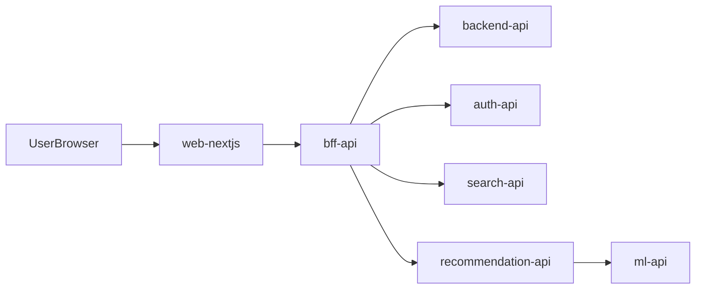
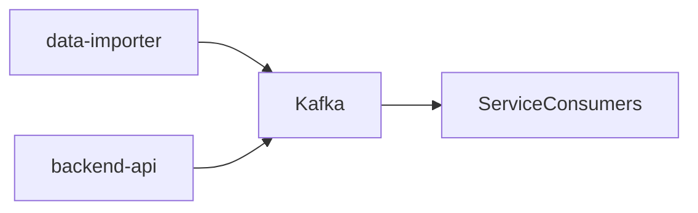

***REMOVED*** Service Map (NextWatch Monorepo)

This document is the index for **what each app/lib does**, **how to run it**, and **how requests flow**.

***REMOVED******REMOVED*** Apps (deployable services)

| Component | Path | Tech | Default port(s) | Run (local dev) | Notes |
| --- | --- | --- | --- | --- | --- |
| Frontend | `apps/web-nextjs` | Next.js (TS) | 3000 | `pnpm dev` | Talks to BFF |
| BFF API | `apps/bff-api` | FastAPI (Py) | 8001 | `hatch run dev` | Aggregation + caching layer |
| Backend API | `apps/backend-api` | FastAPI (Py) | 8000 | `hatch run dev` | Core movie/user data + DB access |
| Auth API | `apps/auth-api` | FastAPI (Py) | 8003 | `hatch run dev` | Auth, JWT, token verification |
| Recommendation API | `apps/recommendation-api` | FastAPI (Py) | 8002 (external), 8000 (internal in compose) | `hatch run dev` | Reco logic, talks to Qdrant + ML API |
| ML API | `apps/ml-api` | FastAPI (Py) | 8004 (external), 8000 (internal in compose) | `hatch run dev` | Embeddings/model service |
| Search API | `apps/search-api` | FastAPI (Py) | 8005 (external), 8000 (internal in compose) | `hatch run dev` | Autocomplete + search features (Redis-backed) |
| Search API (Go) | `apps/search-api-go` | Go | 8080 | `go run ./cmd/search-api` | Minimal Go scaffold |
| Data Importer | `apps/data-importer` | Python | (on-demand) | `hatch run cli ...` | TMDB/OMDB sync + Kafka events |
| Mobile (Flutter) | `apps/mobile-flutter` | Flutter | (n/a) | (see README) | Mobile client |

Read more (service-level docs):

- `apps/backend-api/README.md`
- `apps/auth-api/README.md`
- `apps/bff-api/README.md`
- `apps/recommendation-api/README.md`
- `apps/ml-api/README.md`
- `apps/search-api/README.md`
- `apps/search-api-go/README.md`
- `apps/data-importer/README.md`
- `apps/web-nextjs/README.md`

***REMOVED******REMOVED*** Shared libraries

| Library | Path | Used by | Purpose |
| --- | --- | --- | --- |
| fast-core | `libs/fast-core` | Python services | Shared FastAPI patterns (middleware, health, tracing, errors) |
| config | `libs/config` | Python services | Config loading, masking, logging setup |
| cache | `libs/cache` | Python services | Redis cache utilities + warming patterns |
| kafka | `libs/kafka` | Services + importer | Kafka producer/consumer utilities + schemas conventions |
| cli | `libs/cli` | Python services | Shared CLI patterns and utilities |
| movie-storage | `libs/movie-storage` | Backend/import flows | Storage/models used across services |

Read more:

- `libs/fast-core/README.md`
- `libs/config/README.md`
- `libs/cache/README.md`
- `libs/kafka/README.md`
- `libs/cli/README.md`
- `libs/movie-storage/README.md`

***REMOVED******REMOVED*** Request flow (typical)

***REMOVED******REMOVED*** Data flow (events + import)

***REMOVED******REMOVED*** Infrastructure entrypoints

- Production stack (Docker Compose): `infra/compose/prod.yml` (env: `.env.prod`, template: `infra/env/prod.example`)
- Monitoring stack (Docker Compose): `infra/compose/monitoring.yml` (env: `infra/.env.monitoring.prod`, template: `infra/env/monitoring.prod.example`)
- Infra README (canonical pointers): `infra/README.md`
