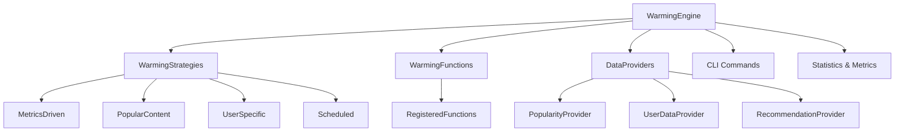

***REMOVED*** Cache Warming System

The NextWatch Cache Library warming system provides intelligent cache preloading capabilities to improve application performance by proactively populating cache entries before they are requested by users.

***REMOVED******REMOVED*** 📋 Table of Contents

- [Overview](***REMOVED***overview)
- [Architecture](***REMOVED***architecture)
- [Core Components](***REMOVED***core-components)
- [Warming Strategies](***REMOVED***warming-strategies)
- [Integration Patterns](***REMOVED***integration-patterns)
- [CLI Usage](***REMOVED***cli-usage)
- [Configuration](***REMOVED***configuration)
- [Implementation Guide](***REMOVED***implementation-guide)
- [Production Usage](***REMOVED***production-usage)

***REMOVED******REMOVED*** Overview

Cache warming solves the "cold cache" problem by:

- **Preloading frequently accessed data** before users request it
- **Reducing response times** for cache misses
- **Improving user experience** with faster page loads
- **Optimizing resource utilization** during off-peak hours

***REMOVED******REMOVED******REMOVED*** Key Benefits

- ⚡ **Performance**: 5-8x faster response times for warmed content
- 🎯 **Intelligence**: Data-driven warming based on actual usage metrics
- 🔄 **Automation**: Multiple strategies for different warming scenarios
- 📊 **Observability**: Comprehensive metrics and success tracking
- 🛠️ **Flexibility**: Easy integration with existing cached functions

***REMOVED******REMOVED*** Architecture



***REMOVED******REMOVED*** Core Components

***REMOVED******REMOVED******REMOVED*** WarmingEngine

The central orchestrator that coordinates all warming operations:

```python
from cache.warming import WarmingEngine, WarmingConfig

***REMOVED*** Initialize with cache manager and metrics
engine = WarmingEngine(
    cache_manager=cache_manager,
    metrics_collector=metrics_collector,
    config=WarmingConfig(
        max_concurrent_operations=5,
        max_items_per_strategy=100,
        min_miss_rate_threshold=0.3
    )
)

***REMOVED*** Register warming functions
engine.register_warming_function("movie_screen", warm_movie_screen)

***REMOVED*** Execute warming
stats = await engine.warm_by_strategy(
    strategy=WarmingStrategy.METRICS_DRIVEN,
    limit=50
)
```

***REMOVED******REMOVED******REMOVED*** WarmingStrategies

Different approaches to identify content for warming:

| Strategy           | Description                            | Use Case                  |
| ------------------ | -------------------------------------- | ------------------------- |
| **MetricsDriven**  | Based on cache miss rates and timing   | Automatic optimization    |
| **PopularContent** | Based on trending/popular content      | Peak traffic preparation  |
| **UserSpecific**   | Based on user behavior and preferences | Personalization           |
| **Scheduled**      | Based on time-based schedules          | Content publishing cycles |

***REMOVED******REMOVED******REMOVED*** WarmingFunctions

Functions that actually populate the cache by calling cached endpoints:

```python
async def warm_movie_screen(movie_id: int, user_id: Optional[int] = None, **kwargs):
    """Warming function that calls the actual cached endpoint."""
    from app.routes import get_movie_screen_data
    from app.dependencies import get_backend_client

    ***REMOVED*** Create dependencies
    backend_client = get_backend_client()

    ***REMOVED*** Call the cached function - this populates the cache
    warmed_data = await get_movie_screen_data(
        movie_id=movie_id,
        user_id=user_id,
        backend=backend_client
    )

    return {
        "cache_populated": True,
        "warming_type": "movie_screen",
        "movie_id": movie_id,
        "user_id": user_id
    }
```

***REMOVED******REMOVED*** Warming Strategies

***REMOVED******REMOVED******REMOVED*** 1. Metrics-Driven Strategy

Automatically identifies functions that would benefit from warming based on:

- **Miss Rate**: Functions with high cache miss ratios
- **Miss Time**: Functions with slow cache miss response times
- **Usage Volume**: Functions with sufficient call volume

**Configuration:**

```python
config = WarmingConfig(
    min_miss_rate_threshold=0.3,      ***REMOVED*** 30% miss rate minimum
    min_avg_miss_time_ms=100.0,       ***REMOVED*** 100ms minimum miss time
    min_total_calls=10,               ***REMOVED*** 10 calls minimum volume
    metrics_driven_weight=1.0         ***REMOVED*** Strategy priority weight
)
```

**Example Output:**

```bash
$ cache warming start --strategy metrics_driven --limit 50

🔥 Metrics-Driven Warming Results
┏━━━━━━━━━━━━━━━━━━━━━━━━━━━━━━━━━┳━━━━━━━━━━━━━━━━━━━━━━━━━━━━━━━━━┓
┃ Function                        ┃ Priority Score                  ┃
┡━━━━━━━━━━━━━━━━━━━━━━━━━━━━━━━━━╇━━━━━━━━━━━━━━━━━━━━━━━━━━━━━━━━━┩
│ get_movie_screen_data          │ 8.5                           │
│ get_movies_list_data           │ 6.2                           │
│ get_genre_screen_data          │ 4.8                           │
└─────────────────────────────────┴─────────────────────────────────┘

✅ Warmed 3 targets successfully (100% success rate)
```

***REMOVED******REMOVED******REMOVED*** 2. Popular Content Strategy

Warms content based on popularity and trending data:

```python
***REMOVED*** Set up popularity data provider
async def get_popularity_data():
    return {
        "movies": [
            {"id": 1, "popularity_score": 9.5, "view_count": 10000},
            {"id": 254, "popularity_score": 8.5, "view_count": 6800}
        ],
        "genres": [
            {"id": 28, "popularity_score": 7.5, "view_count": 3000}
        ]
    }

engine.set_popularity_provider(get_popularity_data)
```

***REMOVED******REMOVED******REMOVED*** 3. User-Specific Strategy

Warms personalized content for active users:

```python
***REMOVED*** Set up user data providers
async def get_user_data(user_id: int):
    return {
        "watchlist": [1, 2, 3, 254, 550],
        "favorite_genres": [28, 12, 16],
        "recently_viewed": [680, 13, 24]
    }

async def get_user_recommendations(user_id: int):
    return [
        {"movie_id": 680, "confidence": 0.95},
        {"movie_id": 13, "confidence": 0.88}
    ]

engine.set_user_data_provider(get_user_data)
engine.set_recommendation_provider(get_user_recommendations)
```

***REMOVED******REMOVED******REMOVED*** 4. Scheduled Strategy

Time-based warming for predictable patterns:

```python
***REMOVED*** Configure scheduled warming
scheduled_targets = [
    {
        "function": "homepage",
        "schedule": "0 6 * * *",  ***REMOVED*** Daily at 6 AM
        "params": {}
    },
    {
        "function": "trending_movies",
        "schedule": "0 */2 * * *",  ***REMOVED*** Every 2 hours
        "params": {"limit": 20}
    }
]
```

***REMOVED******REMOVED*** Integration Patterns

***REMOVED******REMOVED******REMOVED*** Pattern 1: Single Endpoint Integration

1. **Create cached endpoint function:**

```python
@redis_cache(ttl=600, key_builder=my_key_builder)
async def get_my_data(param1: int, param2: str, backend: BackendClient):
    ***REMOVED*** Fetch and aggregate data
    data = await backend.get_data(param1, param2)
    return {"result": data}
```

2. **Create warming function:**

```python
async def warm_my_data(param1: int, param2: str = "default", **kwargs):
    from myapp.routes import get_my_data
    from myapp.dependencies import get_backend_client

    backend = get_backend_client()
    warmed_data = await get_my_data(param1, param2, backend)

    return {
        "cache_populated": True,
        "warming_type": "my_data",
        "params": {"param1": param1, "param2": param2}
    }
```

3. **Register with warming engine:**

```python
engine.register_warming_function("my_data", warm_my_data)
```

***REMOVED******REMOVED******REMOVED*** Pattern 2: Service-Wide Integration

```python
class MyServiceWarmingService:
    def __init__(self):
        self.engine = WarmingEngine(...)
        self._register_warming_functions()
        self._setup_data_providers()

    def _register_warming_functions(self):
        self.engine.register_warming_function("endpoint1", self._warm_endpoint1)
        self.engine.register_warming_function("endpoint2", self._warm_endpoint2)

    def _setup_data_providers(self):
        self.engine.set_popularity_provider(self._get_popularity_data)
        self.engine.set_user_data_provider(self._get_user_data)
```

***REMOVED******REMOVED*** CLI Usage

***REMOVED******REMOVED******REMOVED*** Installation

The warming CLI is available through the cache library:

```bash
***REMOVED*** Install the cache library
pip install -e libs/cache

***REMOVED*** The 'cache' command includes warming subcommands
cache warming --help
```

***REMOVED******REMOVED******REMOVED*** Basic Commands

```bash
***REMOVED*** Show warming system status
cache warming status

***REMOVED*** Start warming with specific strategy
cache warming start --strategy metrics_driven --limit 50
cache warming start --strategy popular_content --limit 30
cache warming start --strategy user_specific --limit 20 --user-ids "1,2,3"
cache warming start --strategy scheduled --limit 40

***REMOVED*** Start warming with all enabled strategies
cache warming start --strategy all --limit 25

***REMOVED*** Show warming configuration
cache warming config

***REMOVED*** Dry run (show what would be warmed without executing)
cache warming start --strategy all --dry-run
```

***REMOVED******REMOVED******REMOVED*** Service-Specific CLI

Services can extend the warming CLI with custom commands:

```bash
***REMOVED*** BFF API warming commands
bff-api warming start --strategy metrics_driven
bff-api warming-test movie_screen --movie-id 1 --user-id 123

***REMOVED*** Backend API warming commands
backend-api warming start --strategy popular_content
backend-api warming-test movie_details --movie-id 1
```

***REMOVED******REMOVED*** Configuration

***REMOVED******REMOVED******REMOVED*** Environment Variables

```bash
***REMOVED*** Warming Engine Configuration
WARMING_MAX_CONCURRENT=5
WARMING_MAX_ITEMS_PER_STRATEGY=100
WARMING_OPERATION_TIMEOUT=30

***REMOVED*** Warming Thresholds
WARMING_MIN_MISS_RATE=0.3
WARMING_MIN_AVG_MISS_TIME=100.0
WARMING_MIN_TOTAL_CALLS=10

***REMOVED*** Strategy Configuration
WARMING_ENABLE_METRICS_DRIVEN=true
WARMING_ENABLE_POPULAR_CONTENT=true
WARMING_ENABLE_USER_SPECIFIC=true
WARMING_ENABLE_SCHEDULED=true

***REMOVED*** Strategy Weights
WARMING_METRICS_DRIVEN_WEIGHT=1.0
WARMING_POPULAR_CONTENT_WEIGHT=0.8
WARMING_USER_SPECIFIC_WEIGHT=0.6
WARMING_SCHEDULED_WEIGHT=0.7
```

***REMOVED******REMOVED******REMOVED*** Programmatic Configuration

```python
config = WarmingConfig(
    ***REMOVED*** Concurrency and Limits
    max_concurrent_operations=5,
    max_items_per_strategy=100,
    operation_timeout_seconds=30,

    ***REMOVED*** Quality Thresholds
    min_miss_rate_threshold=0.3,
    min_avg_miss_time_ms=100.0,
    min_total_calls=10,

    ***REMOVED*** Strategy Control
    enable_metrics_driven=True,
    enable_popular_content=True,
    enable_user_specific=True,
    enable_scheduled=True,

    ***REMOVED*** Priority Weights
    metrics_driven_weight=1.0,
    popular_content_weight=0.8,
    user_specific_weight=0.6,
    scheduled_weight=0.7
)
```

***REMOVED******REMOVED*** Implementation Guide

***REMOVED******REMOVED******REMOVED*** Step 1: Setup Warming Service

```python
from cache.warming import WarmingEngine, WarmingConfig
from cache import CacheManager, get_global_collector

class MyWarmingService:
    def __init__(self):
        self.cache_manager = CacheManager.from_settings()
        self.metrics_collector = get_global_collector()

        self.config = WarmingConfig(
            max_concurrent_operations=5,
            max_items_per_strategy=100,
            enable_metrics_driven=True,
            enable_popular_content=True
        )

        self.engine = WarmingEngine(
            cache_manager=self.cache_manager,
            metrics_collector=self.metrics_collector,
            config=self.config
        )

        self._register_warming_functions()
        self._setup_data_providers()
```

***REMOVED******REMOVED******REMOVED*** Step 2: Register Warming Functions

```python
def _register_warming_functions(self):
    """Register all warming functions."""
    self.engine.register_warming_function("movie_screen", self._warm_movie_screen)
    self.engine.register_warming_function("movies_list", self._warm_movies_list)
    self.engine.register_warming_function("user_dashboard", self._warm_user_dashboard)

async def _warm_movie_screen(self, movie_id: int, user_id: Optional[int] = None, **kwargs):
    """Warm movie screen by calling the actual cached function."""
    try:
        ***REMOVED*** Import the cached function
        from myapp.routes.movies import get_movie_screen_data
        from myapp.dependencies import get_backend_client

        ***REMOVED*** Create dependencies
        backend = get_backend_client()

        ***REMOVED*** Call cached function to populate cache
        warmed_data = await get_movie_screen_data(
            movie_id=movie_id,
            user_id=user_id,
            backend=backend
        )

        return {
            "cache_populated": True,
            "warming_type": "movie_screen",
            "movie_id": movie_id,
            "user_id": user_id,
            "warmed_data_keys": list(warmed_data.keys())
        }

    except Exception as e:
        raise Exception(f"Movie screen warming failed: {e}")
```

***REMOVED******REMOVED******REMOVED*** Step 3: Setup Data Providers

```python
def _setup_data_providers(self):
    """Setup data providers for warming strategies."""
    self.engine.set_popularity_provider(self._get_popularity_data)
    self.engine.set_user_data_provider(self._get_user_data)
    self.engine.set_recommendation_provider(self._get_recommendations)

async def _get_popularity_data(self):
    """Get popularity data for popular content strategy."""
    ***REMOVED*** Query analytics, trending data, etc.
    return {
        "movies": await self._get_trending_movies(),
        "genres": await self._get_popular_genres(),
        "actors": await self._get_trending_actors()
    }

async def _get_user_data(self, user_id: int):
    """Get user profile data for user-specific strategy."""
    ***REMOVED*** Query user service, preferences, history
    return {
        "watchlist": await self._get_user_watchlist(user_id),
        "favorite_genres": await self._get_user_favorite_genres(user_id),
        "recently_viewed": await self._get_user_recent_views(user_id)
    }
```

***REMOVED******REMOVED******REMOVED*** Step 4: Integration Testing

```python
async def test_warming_integration(self):
    """Test that warming functions work correctly."""

    ***REMOVED*** Test individual warming function
    result = await self.engine._warming_functions["movie_screen"](
        movie_id=1, user_id=123
    )
    assert result["cache_populated"] == True

    ***REMOVED*** Test warming strategy
    stats = await self.engine.warm_by_strategy(
        strategy=WarmingStrategy.METRICS_DRIVEN,
        limit=5,
        dry_run=True
    )

    print(f"Would warm {stats.total_targets} targets")

    ***REMOVED*** Test full warming execution
    stats = await self.engine.warm_by_strategy(
        strategy=WarmingStrategy.METRICS_DRIVEN,
        limit=5
    )

    print(f"Successfully warmed {stats.successful_targets} targets")
```

***REMOVED******REMOVED*** Production Usage

***REMOVED******REMOVED******REMOVED*** Monitoring and Alerting

```python
***REMOVED*** Health check for warming system
async def warming_health_check():
    try:
        warming_service = get_warming_service()
        return await warming_service.health_check()
    except Exception:
        return False

***REMOVED*** Warming effectiveness metrics
def get_warming_metrics():
    collector = get_global_collector()
    metrics = collector.get_metrics()

    return {
        "overall_hit_ratio": metrics["overall"]["hit_ratio"],
        "warming_improvement": calculate_warming_improvement(),
        "last_warming_time": get_last_warming_time(),
        "warming_success_rate": get_warming_success_rate()
    }
```

***REMOVED******REMOVED******REMOVED*** Automated Warming

```python
***REMOVED*** Scheduled warming job
async def scheduled_warming_job():
    """Run warming strategies on a schedule."""
    warming_service = get_warming_service()

    ***REMOVED*** Run different strategies based on time of day
    current_hour = datetime.now().hour

    if 6 <= current_hour <= 8:  ***REMOVED*** Morning peak preparation
        await warming_service.engine.warm_by_strategy(
            WarmingStrategy.POPULAR_CONTENT, limit=100
        )
    elif 18 <= current_hour <= 22:  ***REMOVED*** Evening peak preparation
        await warming_service.engine.warm_by_strategy(
            WarmingStrategy.USER_SPECIFIC, limit=50
        )
    else:  ***REMOVED*** Off-peak metrics-driven warming
        await warming_service.engine.warm_by_strategy(
            WarmingStrategy.METRICS_DRIVEN, limit=30
        )

***REMOVED*** Trigger warming on content updates
async def on_content_published(content_type: str, content_id: int):
    """Warm content when new content is published."""
    warming_service = get_warming_service()

    if content_type == "movie":
        await warming_service.engine._warming_functions["movie_screen"](
            movie_id=content_id
        )
    elif content_type == "genre":
        await warming_service.engine._warming_functions["genre_screen"](
            genre_id=content_id
        )
```

***REMOVED******REMOVED******REMOVED*** Performance Optimization

```python
***REMOVED*** Warming strategy optimization
class AdaptiveWarmingConfig:
    def __init__(self):
        self.base_config = WarmingConfig()

    def adjust_for_load(self, system_load: float):
        """Adjust warming aggressiveness based on system load."""
        if system_load > 0.8:
            ***REMOVED*** Reduce warming during high load
            return WarmingConfig(
                max_concurrent_operations=2,
                max_items_per_strategy=25
            )
        elif system_load < 0.3:
            ***REMOVED*** Increase warming during low load
            return WarmingConfig(
                max_concurrent_operations=10,
                max_items_per_strategy=200
            )
        else:
            return self.base_config

***REMOVED*** Load-aware warming execution
async def smart_warming_execution():
    system_load = get_system_load()
    config = AdaptiveWarmingConfig().adjust_for_load(system_load)

    warming_service = get_warming_service()
    warming_service.engine.config = config

    ***REMOVED*** Execute warming with adapted configuration
    await warming_service.engine.warm_all_strategies(limit_per_strategy=50)
```

***REMOVED******REMOVED*** Best Practices

***REMOVED******REMOVED******REMOVED*** 1. Warming Function Design

- **Call actual cached functions** rather than duplicating logic
- **Handle dependencies properly** (create backend clients, etc.)
- **Include comprehensive error handling** and logging
- **Return structured results** for warming statistics
- **Support both anonymous and user-specific warming**

***REMOVED******REMOVED******REMOVED*** 2. Data Provider Implementation

- **Use real data sources** (analytics, user behavior, etc.)
- **Implement caching** for data provider calls to avoid overhead
- **Handle failures gracefully** with fallback data
- **Provide configurable data sources** for different environments

***REMOVED******REMOVED******REMOVED*** 3. Strategy Configuration

- **Start with metrics-driven** strategy for automatic optimization
- **Add popular content** warming for predictable traffic patterns
- **Implement user-specific** warming for personalization
- **Use scheduled warming** for content publishing cycles

***REMOVED******REMOVED******REMOVED*** 4. Monitoring and Observability

- **Track warming effectiveness** with before/after metrics
- **Monitor warming success rates** and failure patterns
- **Alert on warming system failures** or degraded performance
- **Measure warming ROI** with performance improvement metrics

***REMOVED******REMOVED******REMOVED*** 5. Production Deployment

- **Start with conservative settings** (low concurrency, small limits)
- **Gradually increase warming aggressiveness** based on results
- **Implement circuit breakers** for warming system failures
- **Use feature flags** to quickly disable warming if needed

---

***REMOVED******REMOVED*** Examples and Templates

See the [BFF API warming service](../../apps/bff-api/src/bff_api/services/warming_service.py) for a complete implementation example that demonstrates all these patterns in a real application.
