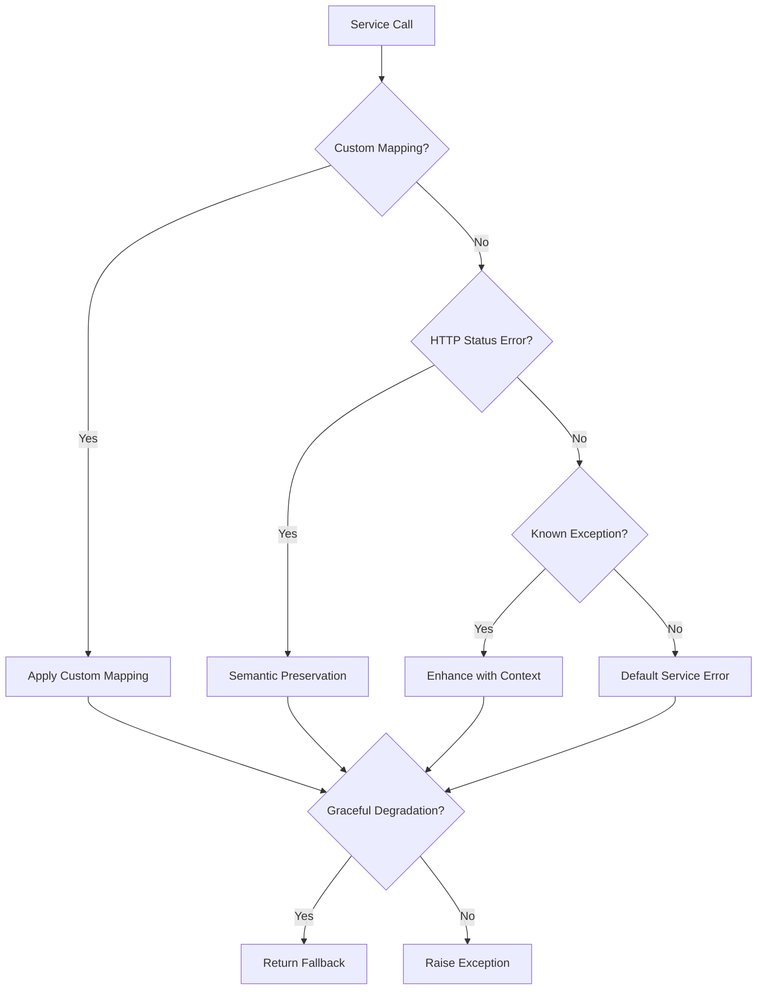

# Enhanced Error Handling in Fast-Core

## Overview

Fast-Core now includes an intelligent error handling system that addresses the core issues identified in the previous implementation:

1. **Semantic Error Preservation**: 404s become `ResourceNotFoundException`, not generic 502s
2. **Graceful Degradation**: Non-critical services can return fallback values instead of failing
3. **Custom Error Mapping**: Business-specific error logic with flexible mapping
4. **Enhanced Context**: Better logging with function arguments and exception types
5. **Service Classification**: Critical vs optional service handling

## Key Features

### 🎯 Semantic Preservation

Preserves the original meaning of HTTP status codes:

```python
# Before: 404 -> ExternalServiceException (502)
# After: 404 -> ResourceNotFoundException (404)

@service_error_handler("backend-api", logger, preserve_semantics=True)
async def get_movie(movie_id: int):
    return await backend.get(f"/movies/{movie_id}")
```

### 🛡️ Graceful Degradation

Non-critical features can gracefully degrade:

```python
@optional_service_handler(
    service_name="recommendation-api",
    logger=logger,
    fallback_value=[]
)
async def get_recommendations(user_id: int):
    # If service fails, returns [] instead of crashing the page
    return await reco_api.get(f"/users/{user_id}/recommendations")
```

### 🎨 Custom Error Mapping

Map specific errors to business logic:

```python
@service_error_handler(
    service_name="payment-api",
    logger=logger,
    error_mapping={
        402: lambda e: PaymentRequiredException("Insufficient funds"),
        "rate_limit": lambda e: RateLimitException("Too many requests"),
    }
)
async def process_payment(amount: float):
    return await payment_api.charge(amount)
```

### 📊 Enhanced Logging

Automatic context enrichment:

```python
# Logs now include:
# - Exception type name
# - Function arguments (safely filtered)
# - Service context
# - Critical/optional classification

@service_error_handler("user-api", logger)
async def get_user_profile(user_id: int, include_private: bool = False):
    # Logs will show: arg_user_id=123, critical=True, etc.
    return await user_api.get(f"/users/{user_id}")
```

## Usage Patterns

### Critical Services (Must Succeed)

```python
@critical_service_handler("auth-api", logger)
async def authenticate_user(token: str):
    """Critical: App cannot function without authentication."""
    return await auth_api.validate(token)
```

### Optional Services (Can Gracefully Degrade)

```python
@optional_service_handler(
    service_name="analytics-api",
    logger=logger,
    fallback_value={"tracked": False}
)
async def track_event(event: str):
    """Optional: App works fine without analytics."""
    return await analytics_api.track(event)
```

### Custom Business Logic

```python
@service_error_handler(
    service_name="inventory-api",
    logger=logger,
    error_mapping={
        409: lambda e: OutOfStockException("Item unavailable"),
        "insufficient_stock": lambda e: LowStockException("Limited availability"),
    }
)
async def reserve_item(item_id: int, quantity: int):
    return await inventory_api.reserve(item_id, quantity)
```

## Migration Guide

### Before (Old Pattern)

```python
@service_error_handler("backend-api", logger)
async def get_similar_movies(movie_id: int):
    try:
        return await backend.get(f"/movies/{movie_id}/similar")
    except Exception as e:
        # Manual handling of 404s, graceful degradation, etc.
        if "404" in str(e):
            return []
        raise
```

### After (Enhanced Pattern)

```python
@optional_service_handler(
    service_name="recommendation-api",
    logger=logger,
    fallback_value=[]
)
async def get_similar_movies(movie_id: int):
    # Automatic semantic preservation and graceful degradation
    return await reco_api.get(f"/movies/{movie_id}/similar")
```

## Benefits

1. **Better User Experience**: Pages don't break when optional services are down
2. **Semantic Correctness**: 404s stay 404s, not generic 502s
3. **Easier Debugging**: Rich logging with function context
4. **Business Logic**: Custom error mapping for domain-specific needs
5. **Service Classification**: Clear distinction between critical and optional
6. **Reduced Boilerplate**: Less manual exception handling code

## Error Flow



## Real-World Example: Recommendation Service Fix

**Problem**: Movie detail page returned 502 when recommendation service had no similar movies (404).

**Before**:

- 404 from recommendation API → BackendClientPermanentError
- Error handler converted to generic ExternalServiceException (502)
- Movie detail page failed completely

**After**:

```python
@optional_service_handler(
    service_name="recommendation-api",
    logger=logger,
    fallback_value=[]
)
async def get_similar_movies(movie_id: int):
    return await reco_api.get(f"/movies/{movie_id}/similar")
```

**Result**:

- 404 from recommendation API → ResourceNotFoundException (semantically preserved)
- Graceful degradation returns empty list instead of failing
- Movie detail page loads successfully with empty recommendations
- Better user experience and proper HTTP semantics

## Testing

Run the comprehensive demo:

```bash
cd libs/fast-core
python examples/error_handling_demo.py
```

This demonstrates all features with real HTTP calls and simulated errors.
