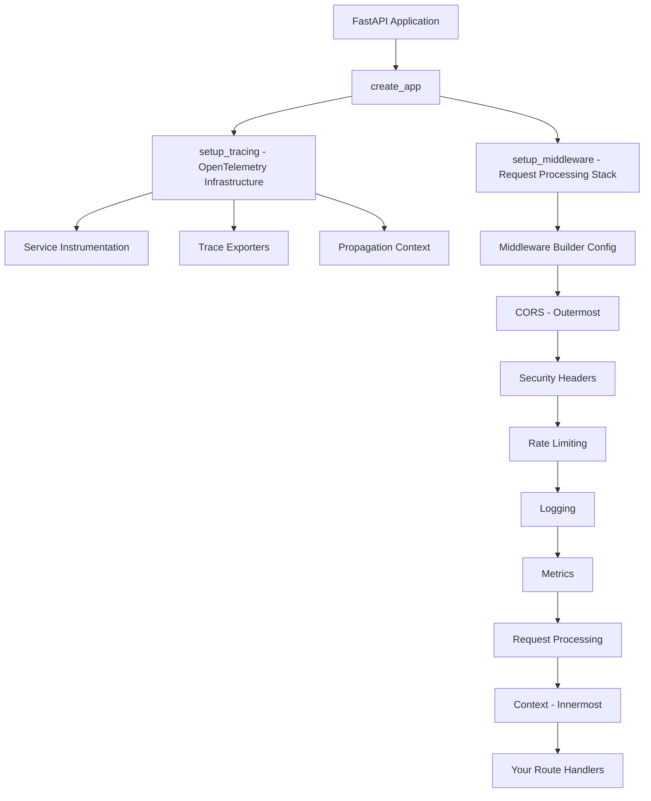

***REMOVED*** Fast Core Middleware System

The Fast Core Middleware System provides a comprehensive, production-ready middleware stack for FastAPI applications with a flexible builder pattern, automatic configuration, and enterprise-grade features.

***REMOVED******REMOVED*** 📁 Module Overview

***REMOVED******REMOVED******REMOVED*** Core Components

| Module                       | Purpose                                   | Key Features                                             |
| ---------------------------- | ----------------------------------------- | -------------------------------------------------------- |
| [`config.py`](./config.py)   | Configuration classes and builder pattern | MiddlewareConfig builder, dataclass configs, type safety |
| [`setup.py`](./setup.py)     | Middleware orchestration and setup        | Automatic middleware ordering, environment detection     |
| [`context.py`](./context.py) | Request context and distributed tracing   | W3C/B3/Jaeger propagation, request correlation           |
| [`tracing.py`](./tracing.py) | OpenTelemetry infrastructure setup        | Auto-instrumentation, trace exporters, service metadata  |

***REMOVED******REMOVED******REMOVED*** Specialized Middleware

| Module                         | Purpose                         | Production Features                                |
| ------------------------------ | ------------------------------- | -------------------------------------------------- |
| [`cors.py`](./cors.py)         | Cross-Origin Resource Sharing   | Environment-aware origins, security validation     |
| [`security.py`](./security.py) | Security headers and protection | HSTS, CSP, frame protection, trusted hosts         |
| [`logging.py`](./logging.py)   | Request/response logging        | Structured logging, sensitive data masking         |
| [`metrics.py`](./metrics.py)   | Prometheus metrics collection   | HTTP metrics, custom buckets, performance tracking |

***REMOVED******REMOVED*** 🏗️ Architecture



***REMOVED******REMOVED*** 🚀 Quick Start

***REMOVED******REMOVED******REMOVED*** Basic Usage

```python
from fast_core.middleware import MiddlewareConfig
from fast_core import create_app

***REMOVED*** Simple configuration
middleware = MiddlewareConfig()
middleware.cors(
    origins=["http://localhost:3000"],
    credentials=True
).request_processing(
    include_request_id=True,
    gzip_compression=True
)

app = create_app(middleware=middleware)
```

***REMOVED******REMOVED******REMOVED*** Production Configuration

```python
middleware = MiddlewareConfig()

***REMOVED*** Production CORS (strict)
middleware.cors(
    origins=["https://app.example.com", "https://mobile.example.com"],
    credentials=True,
    methods=["GET", "POST", "PUT", "DELETE", "PATCH"],
    headers=["Content-Type", "Authorization", "X-Requested-With"],
    expose_headers=["X-Request-ID", "X-Process-Time"],
    max_age=3600
)

***REMOVED*** Security headers (comprehensive)
.security_headers(
    hsts=True,
    hsts_max_age=63072000,  ***REMOVED*** 2 years
    hsts_include_subdomains=True,
    frame_options="DENY",
    content_type_options=True,
    xss_protection=True,
    csp="default-src 'self'; connect-src 'self' https://api.example.com",
    referrer_policy="strict-origin-when-cross-origin",
    trusted_hosts=["app.example.com"]
)

***REMOVED*** Rate limiting (endpoint-specific)
.rate_limiting(
    default_limit="1000/hour",
    endpoints={
        "/api/auth/login": "10/minute",
        "/api/auth/register": "5/minute",
        "/api/upload": "20/minute"
    },
    exempt_ips=["10.0.0.0/8"],
    headers=False  ***REMOVED*** Don't expose limits in production
)

***REMOVED*** Logging (minimal in production)
.logging(
    level="INFO",
    include_request_body=False,
    include_response_body=False,
    exclude_headers=["authorization", "cookie"],
    log_timing=True
)

***REMOVED*** Request processing
.request_processing(
    max_request_size=10 * 1024 * 1024,
    timeout=30,
    include_request_id=True,
    gzip_compression=True
)

***REMOVED*** Metrics (always enabled)
.metrics(
    track_request_size=True,
    track_response_size=True,
    custom_buckets=[0.1, 0.25, 0.5, 1.0, 2.5, 5.0]
)
```

***REMOVED******REMOVED*** 🔧 Module Documentation

***REMOVED******REMOVED******REMOVED*** Configuration System (`config.py`)

The heart of the middleware system, providing type-safe configuration classes and a fluent builder pattern.

**Key Classes:**

- `MiddlewareConfig` - Main builder class with method chaining
- `CORSConfig` - CORS-specific configuration
- `SecurityConfig` - Security headers configuration
- `LoggingConfig` - Request/response logging settings
- `RateLimitConfig` - Rate limiting rules and exemptions
- `RequestConfig` - Request processing settings
- `MetricsConfig` - Prometheus metrics configuration
- `ContextConfig` - Request context and tracing settings

**Example:**

```python
***REMOVED*** All configurations are strongly typed
config = MiddlewareConfig()
config.cors(origins=["https://example.com"])  ***REMOVED*** List[str]
config.security_headers(hsts_max_age=31536000)  ***REMOVED*** int
config.rate_limiting(enabled=True)  ***REMOVED*** bool
```

***REMOVED******REMOVED******REMOVED*** Setup and Orchestration (`setup.py`)

Handles the automatic setup and ordering of middleware components.

**Key Features:**

- **Automatic ordering** - Middleware added in correct sequence
- **Environment detection** - Auto-enables tracing context when available
- **Graceful degradation** - Missing dependencies don't break the stack
- **Performance optimization** - Efficient middleware chain

**Middleware Order (outer to inner):**

1. CORS (Cross-Origin Resource Sharing)
2. Security Headers (HSTS, CSP, Frame Protection)
3. Rate Limiting (Request throttling)
4. Logging (Request/response logging)
5. Metrics (Prometheus collection)
6. Request Processing (Timeouts, compression)
7. Context (Request correlation, tracing)

***REMOVED******REMOVED******REMOVED*** Request Context and Tracing (`context.py`)

Provides distributed tracing context propagation and request correlation across services.

**Key Features:**

- **Multi-format support** - W3C Trace Context, B3 (Zipkin), Jaeger
- **Automatic propagation** - Headers injected into downstream calls
- **Request correlation** - Request IDs for debugging
- **User context** - User ID extraction from JWT tokens
- **OpenTelemetry integration** - Automatic span attributes

**Usage:**

```python
from fast_core.middleware.context import get_request_id, get_trace_headers

***REMOVED*** In your route handlers
async def my_handler():
    request_id = get_request_id()
    trace_headers = get_trace_headers()
    ***REMOVED*** Headers automatically include trace context for downstream calls
```

***REMOVED******REMOVED******REMOVED*** OpenTelemetry Infrastructure (`tracing.py`)

Sets up the foundational OpenTelemetry instrumentation for the entire application.

**Key Features:**

- **Auto-instrumentation** - FastAPI, HTTPx, SQLAlchemy, Redis
- **Trace exporters** - Configurable exporters (OTLP, Jaeger, Console)
- **Service metadata** - Automatic service name, version, environment
- **Resource attributes** - Container, host, deployment information
- **Propagation setup** - Distributed trace correlation

**Automatic Instrumentation:**

- FastAPI requests and responses
- HTTPx client requests (service-to-service)
- SQLAlchemy database queries
- Redis operations
- Custom application spans

***REMOVED******REMOVED******REMOVED*** Cross-Origin Resource Sharing (`cors.py`)

Handles CORS configuration with environment-aware security.

**Features:**

- **Environment-specific origins** - Different origins for dev/prod
- **Security validation** - Prevents wildcard origins in production
- **Credential handling** - Configurable credential support
- **Method/header control** - Fine-grained access control

***REMOVED******REMOVED******REMOVED*** Security Headers (`security.py`)

Comprehensive security header management for production applications.

**Security Features:**

- **HSTS** - HTTP Strict Transport Security
- **CSP** - Content Security Policy
- **Frame protection** - X-Frame-Options
- **Content type sniffing protection**
- **XSS protection**
- **Referrer policy**
- **Trusted host validation**

***REMOVED******REMOVED******REMOVED*** Request/Response Logging (`logging.py`)

Structured logging with sensitive data protection and performance optimization.

**Features:**

- **Structured logging** - JSON format with consistent fields
- **Sensitive data masking** - Automatic header/body sanitization
- **Performance tracking** - Request timing and size metrics
- **Configurable verbosity** - Environment-specific log levels
- **Path exclusion** - Skip logging for health checks

***REMOVED******REMOVED******REMOVED*** Metrics Collection (`metrics.py`)

Prometheus metrics integration for observability and monitoring.

**Metrics:**

- **HTTP request metrics** - Duration, status codes, methods
- **Request/response sizes** - Payload size tracking
- **Custom buckets** - Configurable histogram buckets
- **Endpoint labeling** - Per-route metrics
- **Performance histograms** - Response time distributions

***REMOVED******REMOVED*** 🔄 Integration Patterns

***REMOVED******REMOVED******REMOVED*** Automatic Setup

Fast Core automatically configures middleware when tracing is enabled:

```python
***REMOVED*** In your service configuration
fast_core_config = FastAPIConfig(
    service_name="my-service",
    enable_tracing=True  ***REMOVED*** This triggers automatic context middleware
)

***REMOVED*** Context middleware is automatically added with optimal settings
app = create_app(settings=fast_core_config)
```

***REMOVED******REMOVED******REMOVED*** Manual Configuration

For fine-grained control, use the builder pattern:

```python
middleware = MiddlewareConfig()

***REMOVED*** Environment-specific configuration
if config.is_production:
    middleware.cors(origins=config.cors_origins)
    middleware.security_headers(hsts=True, csp=production_csp)
else:
    middleware.cors(origins=["*"])
    middleware.logging(level="DEBUG", include_request_body=True)

***REMOVED*** Common configuration
middleware.request_processing(include_request_id=True)
middleware.metrics(enabled=True)
```

***REMOVED******REMOVED******REMOVED*** Service-to-Service Integration

The middleware automatically handles service-to-service communication:

```python
***REMOVED*** Headers are automatically injected with trace context
async def call_backend_service():
    ***REMOVED*** get_trace_headers() provides W3C/B3/Jaeger headers
    headers = get_trace_headers()
    response = await httpx.get("http://backend/api", headers=headers)
    return response
```

***REMOVED******REMOVED*** 🛡️ Production Best Practices

***REMOVED******REMOVED******REMOVED*** Security Configuration

```python
***REMOVED*** Production security checklist
middleware.security_headers(
    hsts=True,                    ***REMOVED*** ✅ Force HTTPS
    hsts_max_age=63072000,       ***REMOVED*** ✅ 2 year HSTS
    hsts_include_subdomains=True, ***REMOVED*** ✅ Include subdomains
    frame_options="DENY",         ***REMOVED*** ✅ Prevent clickjacking
    content_type_options=True,    ***REMOVED*** ✅ Prevent MIME sniffing
    xss_protection=True,          ***REMOVED*** ✅ XSS protection
    csp="default-src 'self'",     ***REMOVED*** ✅ Content Security Policy
    trusted_hosts=["yourdomain.com"]  ***REMOVED*** ✅ Host validation
)
```

***REMOVED******REMOVED******REMOVED*** Performance Configuration

```python
***REMOVED*** Performance optimizations
middleware.request_processing(
    gzip_compression=True,        ***REMOVED*** ✅ Compress responses
    gzip_minimum_size=1000,      ***REMOVED*** ✅ Only compress larger responses
    timeout=30,                   ***REMOVED*** ✅ Reasonable timeout
    max_request_size=10_000_000  ***REMOVED*** ✅ 10MB limit
)

middleware.logging(
    include_request_body=False,   ***REMOVED*** ✅ Don't log bodies in prod
    include_response_body=False,  ***REMOVED*** ✅ Reduce log volume
    exclude_paths=["/health"]     ***REMOVED*** ✅ Skip health checks
)
```

***REMOVED******REMOVED******REMOVED*** Monitoring Configuration

```python
***REMOVED*** Comprehensive observability
middleware.metrics(
    track_request_size=True,      ***REMOVED*** ✅ Monitor payload sizes
    track_response_size=True,     ***REMOVED*** ✅ Monitor response sizes
    custom_buckets=[              ***REMOVED*** ✅ SLA-aligned buckets
        0.1, 0.25, 0.5, 1.0, 2.5, 5.0, 10.0
    ],
    exclude_paths=["/metrics"]    ***REMOVED*** ✅ Don't track metrics endpoint
)

***REMOVED*** Automatic tracing context
***REMOVED*** ✅ No configuration needed - automatically enabled
```

***REMOVED******REMOVED*** 🧪 Testing

***REMOVED******REMOVED******REMOVED*** Unit Testing

```python
def test_middleware_config():
    config = MiddlewareConfig()
    config.cors(origins=["https://example.com"])

    assert config.cors_config.origins == ["https://example.com"]
    assert config.cors_config.enabled is True
```

***REMOVED******REMOVED******REMOVED*** Integration Testing

```python
@pytest.mark.asyncio
async def test_middleware_stack():
    middleware = MiddlewareConfig()
    middleware.cors(origins=["*"]).request_processing(include_request_id=True)

    app = create_app(middleware=middleware)

    async with AsyncClient(app=app, base_url="http://test") as client:
        response = await client.get("/")
        assert "x-request-id" in response.headers
```

***REMOVED******REMOVED*** 📊 Monitoring and Observability

***REMOVED******REMOVED******REMOVED*** Metrics Endpoints

- `/metrics` - Prometheus metrics
- `/health` - Health check endpoint
- `/meta` - Service metadata

***REMOVED******REMOVED******REMOVED*** Trace Correlation

All requests automatically include:

- Request ID for correlation
- Trace headers for distributed tracing
- User context for personalization
- Service metadata for routing

***REMOVED******REMOVED******REMOVED*** Log Structure

```json
{
  "timestamp": "2024-01-01T12:00:00Z",
  "level": "info",
  "logger": "fast_core.middleware",
  "event": "request_completed",
  "request_id": "req-123",
  "trace_id": "trace-456",
  "method": "GET",
  "path": "/api/users",
  "status_code": 200,
  "duration_ms": 45.2,
  "user_id": "user-789"
}
```

***REMOVED******REMOVED*** 🔧 Troubleshooting

***REMOVED******REMOVED******REMOVED*** Common Issues

**CORS Issues:**

```python
***REMOVED*** ❌ Wildcard origins in production
middleware.cors(origins=["*"])  ***REMOVED*** Security risk

***REMOVED*** ✅ Explicit origins in production
middleware.cors(origins=["https://yourdomain.com"])
```

**Rate Limiting:**

```python
***REMOVED*** ❌ No Redis configuration
middleware.rate_limiting(default_limit="100/minute")  ***REMOVED*** Uses memory

***REMOVED*** ✅ Redis for distributed rate limiting
middleware.rate_limiting(
    default_limit="100/minute",
    storage_url="redis://localhost:6379/0"
)
```

**Logging Performance:**

```python
***REMOVED*** ❌ Verbose logging in production
middleware.logging(include_request_body=True)  ***REMOVED*** Performance impact

***REMOVED*** ✅ Minimal logging in production
middleware.logging(include_request_body=False, level="INFO")
```

***REMOVED******REMOVED******REMOVED*** Debugging

Enable debug logging to see middleware setup:

```python
import logging
logging.getLogger("fast_core.middleware").setLevel(logging.DEBUG)
```

***REMOVED******REMOVED*** 🎯 Migration Guide

***REMOVED******REMOVED******REMOVED*** From Legacy FastAPI

```python
***REMOVED*** Old way - manual middleware setup
app.add_middleware(CORSMiddleware, allow_origins=["*"])
app.add_middleware(GZipMiddleware, minimum_size=1000)

***REMOVED*** New way - builder pattern
middleware = MiddlewareConfig()
middleware.cors(origins=["*"]).request_processing(gzip_compression=True)
app = create_app(middleware=middleware)
```

***REMOVED******REMOVED******REMOVED*** From Other Frameworks

```python
***REMOVED*** Flask equivalent
middleware.cors(origins=["*"])
middleware.security_headers(hsts=True)
middleware.logging(level="INFO")

***REMOVED*** Express equivalent
middleware.cors(credentials=True)
middleware.request_processing(max_request_size=10_000_000)
middleware.rate_limiting(default_limit="100/minute")
```

---

**Fast Core Middleware System** - Production-ready, type-safe, and highly configurable middleware for modern FastAPI applications.
